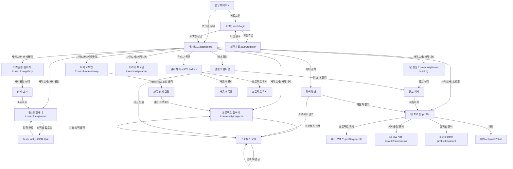

# Information Architecture (As-Built)

## 개요

Media Weave 서비스의 **최종 구현된** 정보 구조 및 네비게이션 체계. 본 문서는 실제 개발 완료된 시스템의 URL 구조, 권한 체계, 네비게이션 흐름을 기록하여 운영 및 유지보수를 위한 참조 문서로 활용.

## 범례

- `[Public]`: 비로그인 사용자 및 외부 방문자 접근 가능
- `[Student]`: 인증된 학생 회원만 접근 가능 (JWT 토큰 필요)
- `[Professor]`: 교수 권한 보유자만 접근 가능
- `[Admin]`: 시스템 관리자 전용 권한
- `(Action)`: 클릭, 드래그 등 사용자의 직접적인 행동
- `(System)`: 데이터 로딩, 계산, 필터링 등 시스템의 백그라운드 처리
- `(OCR System)`: Tesseract.js 기반 이미지 인식 및 텍스트 추출 자동화 프로세스
- `(Feedback)`: Toast, Modal, Animation 등 사용자 행동에 대한 시각적 피드백

## 기술 스택 (Tech Stack)

### Frontend
- **Framework**: React 18.2.0 + Vite 5.2.0
- **Routing**: React Router DOM 7.10.1
- **State Management**: Zustand 5.0.9
- **UI Framework**: Tailwind CSS 3.4.3
- **Data Fetching**: Axios 1.13.2 + TanStack React Query 5.90.12
- **Drag & Drop**: @dnd-kit (core, sortable, utilities)
- **Visualization**: ReactFlow 11.11.4
- **OCR**: Tesseract.js 7.0.0
- **Icons**: Lucide React 0.556.0

### Backend
- **Framework**: Express.js 5.2.1
- **Database**: SQLite3 (개발), PostgreSQL (프로덕션 지원)
- **ORM**: Sequelize 6.37.7
- **Authentication**: JWT + bcrypt
- **File Upload**: Multer 2.0.2

## 실제 구현된 URL 구조

### 인증 관련

| URL | 메서드 | 파라미터 | 쿼리스트링 | 권한 | 설명 |
|-----|--------|----------|-----------|------|------|
| `/auth/login` | GET | - | `redirect?: string` | [Public] | 로그인 페이지 |
| `/auth/register` | GET | - | - | [Public] | 회원가입 페이지 (@ajou.ac.kr 제한) |

### 메인 및 대시보드

| URL | 메서드 | 파라미터 | 쿼리스트링 | 권한 | 설명 |
|-----|--------|----------|-----------|------|------|
| `/` | GET | - | - | [Public] | 랜딩 페이지 (비로그인) |
| `/dashboard` | GET | - | - | [Student] | 사용자 대시보드 (로그인 후) |

### 커리큘럼 관련

| URL | 메서드 | 파라미터 | 쿼리스트링 | 권한 | 설명 |
|-----|--------|----------|-----------|------|------|
| `/curriculum/roadmap` | GET | - | `track?: DE\|CD\|GI\|MD\|VC` | [Public] | ReactFlow 기반 트랙 로드맵 |
| `/curriculum/planner` | GET | - | - | [Student] | 드래그앤드롭 커리큘럼 플래너 |
| `/curriculum/gallery` | GET | - | `track?: string, page?: number` | [Student] | 공유된 커리큘럼 갤러리 |

### 커뮤니티 관련

| URL | 메서드 | 파라미터 | 쿼리스트링 | 권한 | 설명 |
|-----|--------|----------|-----------|------|------|
| `/community/projects` | GET | - | `track?: string, search?: string` | [Public] | 프로젝트 갤러리 |
| `/community/team-building` | GET | - | `field?: string, status?: open\|closed` | [Student] | 팀 빌딩 모집 공고 |
| `/community/career` | GET | - | - | [Student] | 커리어 프로필 갤러리 |

### 프로필 관련

| URL | 메서드 | 파라미터 | 쿼리스트링 | 권한 | 설명 |
|-----|--------|----------|-----------|------|------|
| `/profile` | GET | - | - | [Student] | 내 프로필 |
| `/profile/projects` | GET | - | - | [Student] | 내 프로젝트 관리 |
| `/profile/curriculums` | GET | - | - | [Student] | 내 커리큘럼 관리 |
| `/profile/transcript` | GET | - | - | [Student] | Tesseract.js OCR 성적표 관리 |
| `/profile/chat` | GET | - | - | [Student] | 채팅 메시지 |

### 관리자 관련

| URL | 메서드 | 파라미터 | 쿼리스트링 | 권한 | 설명 |
|-----|--------|----------|-----------|------|------|
| `/admin` | GET | - | - | [Admin] | 관리자 대시보드 |
| `/settings` | GET | - | - | [Student] | 사용자 설정 |

## 실제 구현된 API 엔드포인트

### 인증 API (`/api/v1/auth`)

| 엔드포인트 | 메서드 | 설명 | 인증 |
|-----------|--------|------|------|
| `/register` | POST | 회원가입 (@ajou.ac.kr 제한) | - |
| `/login` | POST | JWT 토큰 발급 | - |

### 프로젝트 API (`/api/v1/projects`)

| 엔드포인트 | 메서드 | 설명 | 인증 |
|-----------|--------|------|------|
| `/` | GET | 프로젝트 목록 조회 (필터링 지원) | - |
| `/` | POST | 프로젝트 생성 (Multer 파일 업로드) | JWT |
| `/:id` | PUT | 프로젝트 수정 | JWT |
| `/:id` | DELETE | 프로젝트 삭제 | JWT |
| `/:id/like` | POST | 좋아요 토글 | JWT |
| `/:id/view` | POST | 조회수 증가 (중복 방지) | JWT |
| `/:id/comments` | GET | 댓글 목록 조회 | - |
| `/:id/comments` | POST | 댓글 작성 | JWT |
| `/comments/:commentId` | PUT | 댓글 수정 | JWT |
| `/comments/:commentId` | DELETE | 댓글 삭제 | JWT |

### 커리큘럼 API (`/api/v1/curriculums`)

| 엔드포인트 | 메서드 | 설명 | 인증 |
|-----------|--------|------|------|
| `/public` | GET | 공개 커리큘럼 갤러리 | - |
| `/save` | POST | 커리큘럼 저장 | JWT |
| `/my` | GET | 내 커리큘럼 목록 | JWT |
| `/shared` | GET | 공유받은 커리큘럼 | JWT |
| `/:id` | GET | 커리큘럼 상세 (조회수 증가) | JWT |
| `/:id` | PUT | 커리큘럼 수정 | JWT |
| `/:id` | DELETE | 커리큘럼 삭제 | JWT |
| `/:id/share` | PATCH | 공유 상태 토글 | JWT |
| `/:id/copy` | POST | 커리큘럼 복사 (스크랩) | JWT |
| `/:id/uncopy` | DELETE | 복사 취소 | JWT |

### 팀 빌딩 API (`/api/v1/teams`)

| 엔드포인트 | 메서드 | 설명 | 인증 |
|-----------|--------|------|------|
| `/posts` | GET | 팀 모집 공고 목록 | JWT |
| `/posts` | POST | 모집 공고 작성 | JWT |
| `/posts/:id` | GET | 공고 상세 | JWT |
| `/posts/:id` | PUT | 공고 수정 | JWT |
| `/posts/:id` | DELETE | 공고 삭제 | JWT |
| `/posts/:id/apply` | POST | 팀 지원 | JWT |
| `/posts/:id/applications` | GET | 지원자 목록 (작성자만) | JWT |

### 성적표 API (`/api/v1/transcripts`)

| 엔드포인트 | 메서드 | 설명 | 인증 |
|-----------|--------|------|------|
| `/` | GET | 내 성적표 목록 | JWT |
| `/upload` | POST | Tesseract.js OCR 업로드 | JWT |
| `/:id` | DELETE | 성적표 삭제 | JWT |

### 사용자 API (`/api/v1/users`)

| 엔드포인트 | 메서드 | 설명 | 인증 |
|-----------|--------|------|------|
| `/profile` | GET | 내 프로필 조회 | JWT |
| `/profile` | PUT | 프로필 수정 | JWT |
| `/:id` | GET | 특정 사용자 프로필 | - |

### 메시지 API (`/api/v1/messages`)

| 엔드포인트 | 메서드 | 설명 | 인증 |
|-----------|--------|------|------|
| `/` | GET | 내 메시지 목록 | JWT |
| `/` | POST | 메시지 전송 | JWT |
| `/:id` | DELETE | 메시지 삭제 | JWT |

### 알림 API (`/api/v1/notifications`)

| 엔드포인트 | 메서드 | 설명 | 인증 |
|-----------|--------|------|------|
| `/` | GET | 알림 목록 | JWT |
| `/:id/read` | PATCH | 알림 읽음 처리 | JWT |

### 관리자 API (`/api/v1/admin`)

| 엔드포인트 | 메서드 | 설명 | 인증 |
|-----------|--------|------|------|
| `/users` | GET | 사용자 관리 | JWT (Admin) |
| `/projects` | GET | 프로젝트 관리 | JWT (Admin) |

## 권한 매트릭스 (실제 구현)

### 페이지별 역할 접근 권한 (실제 구현)

| 페이지 | Public | Student | Admin | 설명 |
|--------|--------|---------|-------|------|
| **인증** |
| `/auth/login` | ✓ | ✓ | ✓ | 로그인 페이지 |
| `/auth/register` | ✓ | - | - | 회원가입 (@ajou.ac.kr 제한) |
| **메인** |
| `/` | ✓ | ✓ | ✓ | 랜딩 페이지 |
| `/dashboard` | - | ✓ | ✓ | 대시보드 |
| **커리큘럼** |
| `/curriculum/roadmap` | ✓ | ✓ | ✓ | ReactFlow 트랙 로드맵 |
| `/curriculum/planner` | - | ✓ | ✓ | 드래그앤드롭 플래너 |
| `/curriculum/gallery` | - | ✓ | ✓ | 공유 커리큘럼 갤러리 |
| **커뮤니티** |
| `/community/projects` | ✓ | ✓ | ✓ | 프로젝트 갤러리 |
| `/community/team-building` | - | ✓ | ✓ | 팀 빌딩 |
| `/community/career` | - | ✓ | ✓ | 커리어 프로필 |
| **프로필** |
| `/profile` | - | ✓ (본인) | ✓ | 내 프로필 |
| `/profile/projects` | - | ✓ (본인) | ✓ | 내 프로젝트 관리 |
| `/profile/curriculums` | - | ✓ (본인) | ✓ | 내 커리큘럼 관리 |
| `/profile/transcript` | - | ✓ (본인) | ✓ | OCR 성적표 관리 |
| `/profile/chat` | - | ✓ | ✓ | 채팅 메시지 |
| **관리자** |
| `/admin` | - | - | ✓ | 관리자 대시보드 |
| `/settings` | - | ✓ | ✓ | 사용자 설정 |

### 기능별 권한 상세 (실제 구현)

| 기능 | Public | Student | Admin | 제약사항 |
|------|--------|---------|-------|----------|
| 트랙 로드맵 조회 | ✓ | ✓ | ✓ | ReactFlow 기반 시각화 |
| 과목 상세 조회 | ✓ | ✓ | ✓ | 모달 팝업 형태 |
| 커리큘럼 플래너 생성 | - | ✓ | ✓ | 드래그앤드롭 인터페이스 |
| 커리큘럼 플래너 편집 | - | ✓ (본인) | ✓ | 본인 플래너만 |
| 커리큘럼 공유 | - | ✓ | ✓ | 공개 설정 토글 |
| 성적표 OCR 업로드 | - | ✓ | ✓ | Tesseract.js 기반 |
| 프로젝트 등록 | - | ✓ | ✓ | Multer 파일 업로드 |
| 프로젝트 수정/삭제 | - | ✓ (작성자) | ✓ | 작성자 또는 관리자 |
| 팀 빌딩 공고 작성 | - | ✓ | ✓ | - |
| 팀 빌딩 지원 | - | ✓ | ✓ | 본인 공고 제외 |
| 댓글 작성 | - | ✓ | ✓ | JWT 인증 필요 |
| 좋아요/조회수 | - | ✓ | ✓ | 중복 방지 로직 |
| 채팅 메시지 | - | ✓ | ✓ | 1:1 및 그룹 채팅 |
| 알림 관리 | - | ✓ | ✓ | 실시간 알림 |
| 사용자 관리 | - | - | ✓ | 관리자 전용 |

## 리다이렉션 규칙 (실제 구현)

### 인증 기반 리다이렉션

| 조건 | 현재 URL | 리다이렉션 대상 | 우선순위 |
|------|----------|----------------|----------|
| 비로그인 상태에서 인증 필요 페이지 접근 | `/curriculum/planner` | `/auth/login?redirect=/curriculum/planner` | 1 |
| 비로그인 상태에서 인증 필요 페이지 접근 | `/profile/*` | `/auth/login?redirect=/profile` | 1 |
| 로그인 상태에서 인증 페이지 접근 | `/auth/login` | `/dashboard` | 2 |
| 로그인 상태에서 랜딩 페이지 접근 | `/` | `/dashboard` | 2 |
| 학생이 관리자 전용 페이지 접근 | `/admin` | `/dashboard` (403 에러) | 3 |

### 데이터 기반 리다이렉션

| 조건 | 현재 URL | 리다이렉션 대상 | 우선순위 |
|------|----------|----------------|----------|
| 존재하지 않는 프로젝트 ID | `/community/projects/:projectId` | `/community/projects` (404 에러) | 4 |
| 존재하지 않는 커리큘럼 ID | `/curriculum/gallery/:curriculumId` | `/curriculum/gallery` (404 에러) | 4 |
| 삭제된 콘텐츠 접근 | 모든 상세 페이지 | 목록 페이지 (410 에러) | 4 |

### 상태 기반 리다이렉션

| 조건 | 현재 URL | 리다이렉션 대상 | 우선순위 |
|------|----------|----------------|----------|
| 첫 로그인 (프로필 미완성) | `/dashboard` | `/profile?onboarding=true` | 6 |
| 성적표 미등록 학생 | `/curriculum/planner` | `/profile/transcript?required=true` | 6 |

## 네비게이션 다이어그램 (실제 구현)

### 전체 페이지 네비게이션 흐름



### 커리큘럼 플래너 상세 흐름 (실제 구현)

```mermaid
graph TD
    A[커리큘럼 플래너 /curriculum/planner] -->|신규 생성| B[빈 플래너 생성]
    A -->|기존 플래너 선택| C[플래너 편집]
    
    C -->|성적표 미등록| D{성적표 업로드 필요}
    D -->|예| E[성적표 페이지로 이동 /profile/transcript]
    E -->|Tesseract.js 업로드| F[OCR 분석]
    F -->|검증 UI| G{사용자 확인}
    G -->|승인| H[이수 과목 자동 배치]
    G -->|수정| F
    H -->|완료| C
    
    D -->|아니오| C
    
    C -->|@dnd-kit 드래그 앤 드롭| I{유효성 검사}
    I -->|선수과목 미이수| J[경고 표시]
    I -->|학점 초과| K[Toast 알림]
    I -->|개설 학기 불일치| L[경고 표시]
    I -->|정상| M[배치 완료]
    
    C -->|저장| N[플래너 저장]
    C -->|공유 설정| O[공개 범위 선택]
    O -->|공개| P[갤러리에 등록]
    
    C -->|트랙 로드맵 참조| Q[로드맵 열기 /curriculum/roadmap]
    Q -->|과목 선택| C
```

### 프로젝트 갤러리 상세 흐름 (실제 구현)

```mermaid
graph TD
    A[프로젝트 갤러리 /community/projects] -->|필터 적용| B{필터 조건}
    B -->|트랙 선택| A
    B -->|검색어 입력| A
    B -->|기술 스택 선택| A
    
    A -->|프로젝트 클릭| C[프로젝트 상세 모달]
    
    C -->|기술 스택 클릭| D[해당 기술 프로젝트 검색]
    D -->|결과 표시| A
    
    C -->|작성자 클릭| E[작성자 프로필]
    
    C -->|좋아요| F[좋아요 카운트 증가 (중복 방지)]
    C -->|조회수| G[조회수 증가 (중복 방지)]
    C -->|공유| H[공유 링크 복사]
    
    C -->|댓글 작성| I{JWT 인증 확인}
    I -->|비로그인| J[로그인 페이지 /auth/login]
    J -->|로그인 성공| C
    I -->|로그인| K[댓글 등록 (Sequelize)]
    
    A -->|프로젝트 등록| L{JWT 인증 확인}
    L -->|비로그인| J
    L -->|로그인| M[프로젝트 작성 폼]
    M -->|Multer 파일 업로드| N[프로젝트 생성]
    N -->|작성 완료| C
```

### 팀 빌딩 상세 흐름 (실제 구현)

```mermaid
graph TD
    A[팀 빌딩 /community/team-building] -->|필터 적용| B{필터 조건}
    B -->|모집 분야| A
    B -->|모집 상태| A
    
    A -->|공고 클릭| C[공고 상세]
    
    C -->|지원하기| D{권한 확인}
    D -->|본인 공고| E[지원 불가 알림]
    D -->|타인 공고| F[지원서 작성 모달]
    F -->|제출| G[지원 완료 (Sequelize)]
    G -->|알림 발송| H[공고 작성자에게 알림]
    
    C -->|지원자 목록 보기| I{작성자 확인}
    I -->|본인 공고| J[지원자 목록 표시]
    J -->|지원자 클릭| K[지원자 프로필]
    K -->|성적 인증 뱃지 확인| L[OCR 인증 데이터 표시]
    I -->|타인 공고| M[접근 불가]
    
    C -->|공고 수정| N{작성자 확인}
    N -->|본인| O[수정 페이지]
    N -->|타인| M
    
    A -->|공고 작성| P{JWT 인증 확인}
    P -->|비로그인| Q[로그인 페이지 /auth/login]
    P -->|로그인| R[공고 작성 폼]
    R -->|작성 완료| C
```

### 관리자 워크플로우 (실제 구현)

```mermaid
graph TD
    A[관리자 대시보드 /admin] -->|사용자 관리| B[사용자 목록]
    A -->|프로젝트 관리| C[프로젝트 관리]
    
    B -->|사용자 선택| D[사용자 상세]
    D -->|권한 변경| E[권한 업데이트 (Sequelize)]
    D -->|계정 정지| F[정지 처리]
    D -->|프로필 보기| G[프로필 페이지]
    
    C -->|프로젝트 선택| H[프로젝트 상세]
    H -->|프로젝트 삭제| I[삭제 처리 (CASCADE)]
    H -->|프로젝트 숨김| J[숨김 처리]
```

## 페이지 계층 구조 (실제 구현)

### Breadcrumb 정의

| 페이지 | Breadcrumb | 부모 페이지 |
|--------|-----------|------------|
| `/dashboard` | 홈 | - |
| `/curriculum/roadmap` | 홈 > 커리큘럼 > 트랙 로드맵 | `/dashboard` |
| `/curriculum/planner` | 홈 > 커리큘럼 > 나만의 플래너 | `/dashboard` |
| `/curriculum/gallery` | 홈 > 커리큘럼 > 커리큘럼 갤러리 | `/dashboard` |
| `/community/projects` | 홈 > 커뮤니티 > 프로젝트 갤러리 | `/dashboard` |
| `/community/team-building` | 홈 > 커뮤니티 > 팀 빌딩 | `/dashboard` |
| `/community/career` | 홈 > 커뮤니티 > 커리어 프로필 | `/dashboard` |
| `/profile` | 홈 > 프로필 | `/dashboard` |
| `/profile/projects` | 홈 > 프로필 > 내 프로젝트 | `/profile` |
| `/profile/curriculums` | 홈 > 프로필 > 내 커리큘럼 | `/profile` |
| `/profile/transcript` | 홈 > 프로필 > 성적표 관리 | `/profile` |
| `/profile/chat` | 홈 > 프로필 > 채팅 | `/profile` |
| `/admin` | 홈 > 관리자 | `/dashboard` |
| `/settings` | 홈 > 설정 | `/dashboard` |

## 1. Global Navigation (실제 구현)

> Tailwind CSS 기반 반응형 디자인으로 구현된 네비게이션 시스템. 사이드바(Sidebar) 방식으로 구현되어 있으며, 모바일에서는 햄버거 메뉴로 변환됩니다.

- **Logo (Home)**
    - (Action: 클릭 시 대시보드(로그인 후) 또는 랜딩 페이지(로그인 전)로 이동)
- **사이드바 메뉴 (Sidebar Navigation)**
    - **커리큘럼 (Curriculum)**
        - 트랙 로드맵 (ReactFlow 기반)
        - 나만의 플래너 (@dnd-kit 드래그앤드롭)
        - 커리큘럼 갤러리 (공유 커리큘럼)
    - **커뮤니티 (Community)**
        - 프로젝트 갤러리 (Multer 파일 업로드 지원)
        - 팀 빌딩 (모집 공고)
        - 커리어 프로필
    - **프로필 (Profile)**
        - 내 프로필
        - 내 프로젝트 관리
        - 내 커리큘럼 관리
        - 성적표 관리 (Tesseract.js OCR)
        - 채팅 메시지
- **헤더 유틸리티 영역 (Header Utilities)**
    - **통합 검색 (Global Search):** Lucide React 아이콘 사용
    - **알림 (Notification):** 실시간 알림 드롭다운 (읽지 않은 알림 개수 표시)
    - **프로필 드롭다운:** 사용자 썸네일, 다크모드 토글, 로그아웃

## 2. Page Structure (실제 구현된 상세 구조)

### 1. Home (메인)

- **Depth 1: Landing Page (로그인 전) `[Public]`**
    
    > React 18.2.0 + Vite 기반으로 구현된 랜딩 페이지. Tailwind CSS로 스타일링되어 있습니다.
    > 
    - **Depth 2: 히어로 섹션 (Hero Section)**
        - (Visual: Tailwind CSS 애니메이션으로 구현된 서비스 소개)
        - (Action: "시작하기" CTA 버튼 클릭 → React Router로 회원가입 페이지 이동)
    - **Depth 2: 기능 소개 (Feature Highlights)**
        - (Display: OCR 기능, 드래그앤드롭 플래너, 프로젝트 갤러리 소개)
        - (Action: 각 기능 카드 클릭 시 해당 페이지로 이동)

- **Depth 1: User Dashboard (로그인 후) `[Student]`**
    
    > Zustand 상태 관리와 TanStack React Query를 활용한 개인화 대시보드입니다.
    > 
    - **Depth 2: 학업 현황 요약 (Academic Status)**
        - (System: Sequelize ORM을 통한 성적 데이터 조회 및 GPA 계산)
        - (Display: Chart.js 또는 Tailwind CSS로 구현된 진행률 표시)
        - (Action: '상세 분석 보기' 클릭 시 `/profile/transcript`로 이동)
    - **Depth 2: 최근 활동 (Recent Activities)**
        - (System: 최근 프로젝트, 커리큘럼, 팀 빌딩 활동 표시)
        - (Action: 각 활동 클릭 시 해당 상세 페이지로 이동)

### 2. Curriculum (커리큘럼)

- **Depth 1: 트랙 로드맵 (Track Roadmap) `[Public]`**
    
    > ReactFlow 11.11.4를 사용하여 구현된 인터랙티브 로드맵 시각화입니다.
    > 
    - **Depth 2: 로드맵 뷰어 (Interactive Graph)**
        - (Action: 좌측 트랙 필터 토글 → ReactFlow 노드 스타일 동적 변경)
        - (Action: 마우스 휠 줌인/줌아웃, 드래그로 패닝)
        - (System: Sequelize Course 모델 데이터를 ReactFlow 노드로 변환)
        - **Depth 3: 과목 상세 모달 (Course Detail Modal)**
            - (System: Course 모델의 상세 정보 표시)
            - (Display: 과목명, 학점, 선수과목, 개설 학기 등)
            - (Action: '관련 프로젝트 보기' → `/community/projects?course=:courseId`)

- **Depth 1: 나만의 커리큘럼 (Planner) `[Student]`**
    
    > @dnd-kit을 사용한 드래그앤드롭 인터페이스로 구현된 커리큘럼 플래너입니다.
    > 
    - **Depth 2: 플래너 편집기 (Editor Interface)**
        - **Depth 3: 성적표 불러오기 (Import Transcript with OCR)**
            - (Action: '성적표 업로드' 버튼 → `/profile/transcript` 페이지로 이동)
            - (OCR System: Tesseract.js 7.0.0 기반 이미지 텍스트 추출)
            - (System: 추출된 데이터를 Transcript 모델에 저장)
            - (Action: 검증 완료 후 StudentCurriculum 테이블에 이수 과목 자동 등록)
        - (Action: @dnd-kit/sortable을 사용한 과목 카드 드래그앤드롭)
        - (System: **실시간 유효성 검사** - Course 모델의 prerequisites 필드 검증)
        - (Feedback: Tailwind CSS 기반 경고 스타일 및 Toast 알림)

- **Depth 1: 커리큘럼 갤러리 (Gallery) `[Student]`**
    - **Depth 2: 갤러리 리스트**
        - (System: SavedCurriculum 모델에서 is_shared=true인 데이터 조회)
        - (Action: 필터링 및 검색 기능)
    - **Depth 2: 상세 보기 & 복사**
        - (Action: '내 플래너로 복사' → SavedCurriculum 복사 API 호출)
        - (System: 조회수 증가 (SavedCurriculumView 테이블 활용))

### 3. Community (커뮤니티)

- **Depth 1: 프로젝트 갤러리 (Project Gallery) `[Public]`**
    
    > Multer 2.0.2 기반 파일 업로드와 Sequelize 관계형 데이터 모델링으로 구현된 프로젝트 아카이브입니다.
    > 
    - **Depth 2: 프로젝트 리스트**
        - (System: Project 모델 + User, Track, Course 조인 쿼리)
        - (Action: 다중 필터 (트랙, 기술스택, 검색어) 적용)
        - (Display: 카드형 UI, 썸네일 이미지, 좋아요/조회수 표시)
    - **Depth 2: 프로젝트 상세**
        - (System: Like, Comment, ProjectView 모델을 통한 소셜 기능)
        - (Action: 좋아요 토글 (중복 방지 로직), 댓글 CRUD)
        - (Action: 기술 스택 클릭 → 해당 기술 필터링된 목록으로 이동)

- **Depth 1: 팀 빌딩 (Team Building) `[Student]`**
    
    > TeamPost, TeamApplication 모델 기반의 팀 모집 시스템입니다.
    > 
    - **Depth 2: 모집 공고 리스트 & 상세**
        - (System: TeamPost 모델 + User 조인으로 작성자 정보 표시)
        - (Action: 지원하기 → TeamApplication 모델에 지원 데이터 저장)
        - (System: 알림 시스템 연동 (Notification 모델))
    - **Depth 2: 지원자 관리**
        - (System: 작성자만 지원자 목록 조회 가능 (권한 검증))
        - (Display: 지원자의 성적 인증 뱃지 (Transcript 데이터 기반))

- **Depth 1: 커리어 프로필 (Career Profile) `[Student]`**
    - **Depth 2: 프로필 갤러리**
        - (System: User 모델 + 관련 프로젝트, 성적 데이터 집계)
        - (Display: 포트폴리오 형태의 프로필 카드)

### 4. Profile (프로필)

- **Depth 1: 내 프로필 (My Profile) `[Student]`**
    - **Depth 2: 프로필 정보**
        - (System: User 모델 데이터 표시 및 수정)
        - (Action: 프로필 이미지 업로드 (Multer), 소셜 링크 관리)
    - **Depth 2: 프로젝트 관리 (`/profile/projects`)**
        - (System: 내가 작성한 Project 목록 조회)
        - (Action: 프로젝트 CRUD, 공개/비공개 설정)
    - **Depth 2: 커리큘럼 관리 (`/profile/curriculums`)**
        - (System: 내가 생성한 SavedCurriculum 목록)
        - (Action: 커리큘럼 편집, 공유 설정 토글)
    - **Depth 2: 성적표 관리 (`/profile/transcript`)**
        - (System: Tesseract.js OCR 업로드 인터페이스)
        - (Action: 이미지 업로드 → OCR 분석 → Transcript 모델 저장)
        - (Display: 학기별 성적 표시, GPA 계산)
    - **Depth 2: 채팅 (`/profile/chat`)**
        - (System: Message 모델 기반 1:1 및 그룹 채팅)
        - (Action: 메시지 전송, 채팅방 목록 관리)

### 5. Admin (관리자) `[Admin]`

- **Depth 1: 관리자 대시보드 (`/admin`)**
    - **Depth 2: 사용자 관리**
        - (System: User 모델 전체 조회, 권한 변경)
        - (Action: 계정 정지, 권한 수정)
    - **Depth 2: 프로젝트 관리**
        - (System: 모든 Project 조회 및 관리)
        - (Action: 부적절한 프로젝트 삭제/숨김 처리)

### 6. Settings (설정) `[Student]`

- **Depth 1: 사용자 설정 (`/settings`)**
    - **Depth 2: 계정 설정**
        - (System: User 모델 개인정보 수정)
        - (Action: 비밀번호 변경, 알림 설정)
    - **Depth 2: 테마 설정**
        - (System: Zustand uiStore의 다크모드 토글)
        - (Action: Tailwind CSS 다크모드 클래스 적용)