# User Flow

> **Media Weave** 사용자 플로우 설계 문서
> 
> 본 문서는 주요 사용자 시나리오별 화면 전환 및 인터랙션 흐름을 정의합니다.

---

## 1. 사용자 플로우 개요 (User Flow Overview)

### 1.1. 주요 사용자 여정 (User Journeys)

1. **신규 사용자 온보딩** - 회원가입부터 첫 커리큘럼 생성까지
2. **커리큘럼 설계** - 트랙 로드맵 탐색 및 나만의 플랜 작성
3. **프로젝트 아카이빙** - 프로젝트 업로드 및 공유
4. **팀 빌딩** - 팀원 모집 및 지원
5. **포트폴리오 구축** - 프로필 완성 및 외부 공유

### 1.2. 사용자 유형별 목표

| 사용자 유형 | 주요 목표 | 핵심 기능 |
|------------|----------|----------|
| **2학년 김후배** | 트랙 선택 및 수강 계획 수립 | 트랙 로드맵, 커리큘럼 플래너 |
| **4학년 이선배** | 포트폴리오 완성 및 팀원 모집 | 프로젝트 갤러리, 팀 빌딩 |
| **교수/조교** | 학생 프로젝트 확인 및 관리 | 프로젝트 갤러리 조회 |

---

## 2. 신규 사용자 온보딩 플로우

### 2.1. 회원가입 플로우

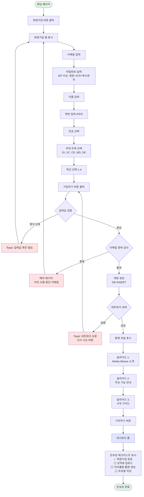

**의사결정 분기점**:
- **입력값 검증**: 이메일 형식, 비밀번호 강도, 학번 9자리 검증
- **이메일 중복 검사**: DB 조회하여 기존 사용자 확인
- **네트워크 상태**: API 호출 성공/실패 처리

**예외 처리**:
- 형식 오류 → Toast 메시지 + 폼 유지
- 중복 이메일 → 에러 메시지 + 이메일 필드 포커스
- 네트워크 오류 → Toast + 재시도 버튼

### 2.2. 로그인 플로우

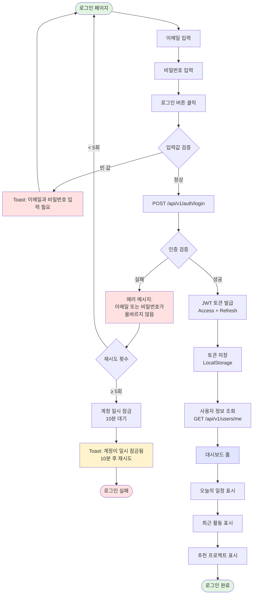

**의사결정 분기점**:
- **입력값 검증**: 이메일/비밀번호 빈 값 체크
- **인증 검증**: DB 조회 및 비밀번호 해시 비교
- **재시도 횟수**: 5회 이상 실패 시 계정 일시 잠금

**예외 처리**:
- 빈 값 → Toast 메시지
- 인증 실패 → 에러 메시지 + 재시도 허용
- 5회 이상 실패 → 계정 잠금 + 10분 대기

### 2.3. 첫 커리큘럼 생성 플로우

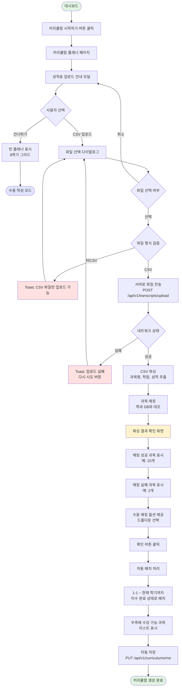

**의사결정 분기점**:
- **사용자 선택**: CSV 업로드 vs 건너뛰기
- **파일 선택 여부**: 파일 선택 vs 취소
- **파일 형식 검증**: CSV 형식 확인
- **네트워크 상태**: 업로드 성공/실패

**예외 처리**:
- 비CSV 파일 → Toast + 재선택
- 업로드 실패 → Toast + 재시도 버튼
- 매칭 실패 과목 → 수동 매칭 옵션 제공

---

## 3. 커리큘럼 설계 플로우

### 3.1. 트랙 로드맵 탐색 플로우

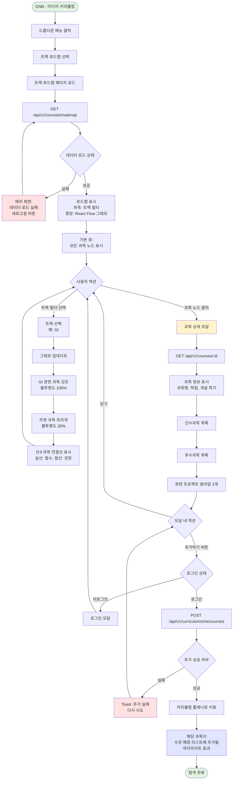

**의사결정 분기점**:
- **데이터 로드 상태**: API 성공/실패
- **사용자 액션**: 트랙 필터 선택 vs 과목 노드 클릭
- **로그인 상태**: 로그인 vs 비로그인
- **추가 성공 여부**: 과목 추가 성공/실패

**예외 처리**:
- 데이터 로드 실패 → 에러 화면 + 새로고침 버튼
- 비로그인 상태 → 로그인 모달
- 과목 추가 실패 → Toast + 재시도

### 3.2. 커리큘럼 플래너 사용 플로우

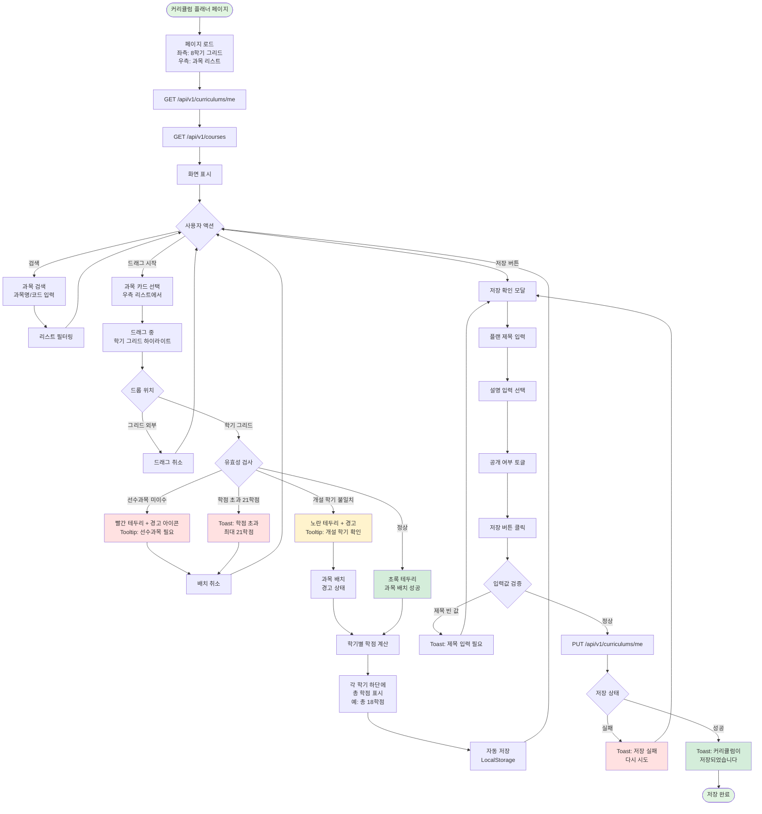

**의사결정 분기점**:
- **사용자 액션**: 검색 vs 드래그 vs 저장
- **드롭 위치**: 그리드 내부 vs 외부
- **유효성 검사**: 선수과목, 학점, 개설 학기 검증
- **입력값 검증**: 제목 빈 값 체크
- **저장 상태**: API 성공/실패

**예외 처리**:
- 선수과목 미이수 → 빨간 테두리 + 배치 취소
- 학점 초과 → Toast + 배치 취소
- 개설 학기 불일치 → 노란 테두리 + 경고 표시
- 제목 빈 값 → Toast + 모달 유지
- 저장 실패 → Toast + 재시도

### 3.3. 공유된 커리큘럼 참고 플로우

```
[GNB - 미디어 커리큘럼]
    ↓ ("공유된 커리큘럼" 클릭)
[공유된 커리큘럼 갤러리]
    ├─ 필터: 트랙, 학년, 졸업 여부
    └─ 카드형 리스트
    ↓ (특정 커리큘럼 카드 클릭)
[커리큘럼 상세 보기]
    ├─ 작성자 정보 (이름, 트랙, 학년)
    ├─ 8학기 플랜 시각화
    ├─ 총 이수 학점, 평점 (선택 공개)
    └─ [내 플래너로 복사하기] 버튼
    ↓ (복사하기 버튼 클릭)
[복사 확인 모달]
    └─ "이 플랜을 내 커리큘럼으로 가져오시겠습니까?"
    ↓ (확인)
[내 커리큘럼 플래너]
    └─ 선배의 플랜이 "수강 예정" 상태로 복사됨
```

---

## 4. 프로젝트 아카이빙 플로우

### 4.1. 프로젝트 업로드 플로우

```mermaid
flowchart TD
    Start([GNB - 커뮤니티]) --> GalleryClick[프로젝트 갤러리 클릭]
    GalleryClick --> Gallery[프로젝트 갤러리 페이지]
    Gallery --> CreateBtn[+ 프로젝트 등록 버튼<br/>우측 상단]
    
    CreateBtn --> CheckAuth{로그인 상태}
    CheckAuth -->|비로그인| LoginModal[로그인 모달]
    LoginModal --> Start
    
    CheckAuth -->|로그인| Step1[Step 1: 기본 정보]
    Step1 --> InputTitle[프로젝트 제목 입력]
    InputTitle --> InputIntro[한 줄 소개 입력]
    InputIntro --> SelectTrack[트랙 선택<br/>GI, VC, CD, MD, DE]
    SelectTrack --> SelectType[프로젝트 유형<br/>팀/개인/졸업작품/공모전]
    SelectType --> Next1[다음 버튼]
    
    Next1 --> Validate1{Step 1 검증}
    Validate1 -->|빈 값| Step1Error[Toast: 필수 항목 입력 필요]
    Step1Error --> Step1
    
    Validate1 -->|정상| Step2[Step 2: 미디어 업로드]
    Step2 --> UploadThumb[썸네일 이미지 업로드<br/>필수]
    UploadThumb --> UploadMedia[추가 이미지/동영상<br/>최대 10개<br/>드래그 앤 드롭]
    UploadMedia --> Next2[다음 버튼]
    
    Next2 --> Validate2{Step 2 검증}
    Validate2 -->|썸네일 없음| Step2Error[Toast: 썸네일 필수]
    Step2Error --> Step2
    Validate2 -->|파일 크기 초과| SizeError[Toast: 파일 크기 초과<br/>최대 10MB]
    SizeError --> Step2
    
    Validate2 -->|정상| Step3[Step 3: 상세 정보]
    Step3 --> InputPeriod[진행 기간<br/>시작일 ~ 종료일]
    InputPeriod --> SelectSemester[수행 학기 선택]
    SelectSemester --> SelectCourse[연관 과목 선택<br/>검색 가능]
    SelectCourse --> AddTags[기술 스택 태그 추가<br/>React, Unity 등]
    AddTags --> Next3[다음 버튼]
    
    Next3 --> Validate3{Step 3 검증}
    Validate3 -->|기간 오류| Step3Error[Toast: 종료일이<br/>시작일보다 빠름]
    Step3Error --> Step3
    
    Validate3 -->|정상| Step4[Step 4: 팀원 정보]
    Step4 --> AddMember[팀원 추가<br/>이메일 검색]
    AddMember --> AssignRole[역할 지정<br/>PM, Frontend, Backend]
    AssignRole --> SetContrib[기여도 설정 선택]
    SetContrib --> Next4[다음 버튼]
    Next4 --> Step5[Step 5: 본문 작성]
    
    Step5 --> MarkdownEditor[Markdown 에디터<br/>실시간 미리보기]
    MarkdownEditor --> InsertImage[이미지 삽입 지원]
    InsertImage --> SubmitBtn[등록 버튼]
    
    SubmitBtn --> Validate5{Step 5 검증}
    Validate5 -->|본문 빈 값| Step5Error[Toast: 본문 입력 필요]
    Step5Error --> Step5
    
    Validate5 -->|정상| UploadS3[S3에 이미지 업로드]
    UploadS3 --> S3Check{업로드 상태}
    S3Check -->|실패| UploadError[Toast: 업로드 실패<br/>다시 시도]
    UploadError --> Step5
    
    S3Check -->|성공| SaveDB[PostgreSQL에<br/>메타데이터 저장<br/>POST /api/v1/projects]
    SaveDB --> DBCheck{저장 상태}
    DBCheck -->|실패| SaveError[Toast: 저장 실패<br/>다시 시도]
    SaveError --> Step5
    
    DBCheck -->|성공| SuccessToast[Toast: 프로젝트가<br/>등록되었습니다]
    SuccessToast --> Navigate[프로젝트 상세 페이지로 이동]
    Navigate --> End([등록 완료])
    
    style Start fill:#e1f5e1
    style End fill:#e1f5e1
    style Step1Error fill:#ffe1e1
    style Step2Error fill:#ffe1e1
    style SizeError fill:#ffe1e1
    style Step3Error fill:#ffe1e1
    style Step5Error fill:#ffe1e1
    style UploadError fill:#ffe1e1
    style SaveError fill:#ffe1e1
    style SuccessToast fill:#d4edda
```

**의사결정 분기점**:
- **로그인 상태**: 로그인 vs 비로그인
- **각 Step 검증**: 필수 항목, 파일 크기, 기간 유효성
- **업로드 상태**: S3 업로드 성공/실패
- **저장 상태**: DB 저장 성공/실패

**예외 처리**:
- 비로그인 → 로그인 모달
- 필수 항목 누락 → Toast + 해당 Step 유지
- 파일 크기 초과 → Toast + 재업로드
- 기간 오류 → Toast + 수정 요청
- 업로드/저장 실패 → Toast + 재시도

### 4.2. 프로젝트 탐색 플로우

```
[프로젝트 갤러리]
    ├─ 좌측: 필터 사이드바
    │   ├─ 트랙 (다중 선택)
    │   ├─ 기술 스택 (다중 선택)
    │   ├─ 학년 (다중 선택)
    │   └─ 정렬 (최신순, 인기순, 조회순)
    └─ 우측: 카드형 그리드
    ↓ (필터 선택: GI + React)
[필터링된 결과 표시]
    └─ API 호출: GET /api/v1/projects?track_type=GI&tech_stack=React
    ↓ (특정 프로젝트 카드 클릭)
[프로젝트 상세 페이지]
    ├─ Header: 미디어 슬라이더 + 프로젝트 정보
    ├─ Meta Info: 기간, 학기, 기술 스택, 팀원
    ├─ Content: Markdown 본문
    ├─ Footer: 추천 프로젝트
    └─ 우측 플로팅: [좋아요] [스크랩] [공유] 버튼
    ↓ (좋아요 버튼 클릭)
[좋아요 처리]
    ├─ 로그인 확인
    │   ├─ 비로그인 → 로그인 모달
    │   └─ 로그인 → API 호출
    ├─ POST /api/v1/projects/:id/like
    ├─ Optimistic UI 업데이트 (즉시 하트 채우기)
    └─ 좋아요 수 +1
```

### 4.3. 연관 과목 Deep Linking 플로우

```
[프로젝트 상세 페이지]
    ↓ (Meta Info 영역의 "연관 과목" 카드 클릭)
[트랙 로드맵 페이지로 이동]
    ├─ URL: /curriculum/roadmap?highlightNode=CSE301
    ├─ 해당 과목 노드로 자동 스크롤
    ├─ 노드 줌인 애니메이션 (1.5배 확대)
    └─ 노드 강조 (펄스 효과)
    ↓ (3초 후)
[강조 효과 해제]
    └─ 일반 상태로 복귀
```

---

## 5. 팀 빌딩 플로우

### 5.1. 팀원 모집 플로우

```
[GNB - 커뮤니티]
    ↓ ("팀 빌딩" 클릭)
[팀 빌딩 게시판]
    ↓ ([+ 모집 공고 작성] 버튼)
[모집 공고 작성 폼]
    ├─ 제목 입력
    ├─ 프로젝트 유형 선택 (졸업작품, 공모전, 스터디 등)
    ├─ 모집 분야 선택 (기획, 디자인, 개발 등)
    ├─ 필요 기술 스택 태그 추가
    ├─ 모집 인원 입력
    ├─ 마감 기한 선택
    ├─ 상세 설명 작성 (Markdown)
    └─ [등록] 버튼
    ↓
[DB 저장]
    └─ PostgreSQL TeamBuilding 테이블에 저장
    ↓
[게시글 상세 페이지로 이동]
    └─ 우측에 [지원하기] 버튼 표시
```

### 5.2. 팀 지원 플로우

```
[팀 빌딩 게시판]
    ↓ (특정 모집 공고 클릭)
[모집 공고 상세]
    ├─ 프로젝트 정보
    ├─ 필요 기술 스택
    ├─ 작성자 프로필 (간략)
    │   └─ 인증 뱃지 표시 (이수 과목 기반)
    └─ [지원하기] 버튼
    ↓ (지원하기 버튼 클릭)
[로그인 확인]
    ├─ 비로그인 → 로그인 모달
    └─ 로그인 → 지원 모달
    ↓
[지원 모달]
    ├─ 내 프로필 미리보기
    │   ├─ 이름, 트랙, 학년
    │   ├─ 보유 기술 스택
    │   └─ 관련 프로젝트 경험
    ├─ 간단한 자기소개 입력
    └─ [지원하기] 버튼
    ↓
[쪽지 전송]
    ├─ 작성자에게 알림 발송
    └─ 성공 Toast: "지원이 완료되었습니다"
```

### 5.3. 모집 상태 관리 플로우

```
[내가 작성한 모집 공고]
    ↓ (상세 페이지 진입)
[관리 버튼 표시]
    ├─ [모집 마감] 버튼
    ├─ [수정] 버튼
    └─ [삭제] 버튼
    ↓ ([모집 마감] 클릭)
[상태 변경 확인 모달]
    └─ "모집을 마감하시겠습니까?"
    ↓ (확인)
[API 호출]
    ├─ PATCH /api/v1/team-building/:id/status
    ├─ Body: { "status": "closed" }
    └─ 게시글 상태 업데이트
    ↓
[UI 업데이트]
    ├─ 제목 옆에 [모집 마감] 뱃지 표시
    └─ [지원하기] 버튼 비활성화
```

---

## 6. 포트폴리오 구축 플로우

### 6.1. 프로필 작성 플로우

```
[GNB - 프로필 아이콘]
    ↓ (드롭다운 메뉴)
    ↓ ("내 프로필" 클릭)
[프로필 페이지]
    ├─ 좌측: 프로필 정보
    │   ├─ 프로필 사진
    │   ├─ 이름, 학번
    │   ├─ 트랙, 학년
    │   ├─ 한 줄 소개
    │   └─ 외부 링크 (GitHub, LinkedIn)
    └─ 우측: 탭 영역
        ├─ Projects (내가 등록한 프로젝트)
        ├─ Posts (팀 빌딩 게시글)
        └─ Curriculums (커리큘럼 플랜)
    ↓ (우측 상단 [편집] 버튼)
[프로필 편집 모달]
    ├─ 프로필 사진 업로드
    ├─ 한 줄 소개 입력
    ├─ GitHub URL 입력
    ├─ LinkedIn URL 입력
    └─ [저장] 버튼
    ↓
[API 호출]
    └─ PATCH /api/v1/users/me/profile
    ↓
[프로필 페이지 새로고침]
    └─ 업데이트된 정보 표시
```

### 6.2. Markdown 프로필 업로드 플로우

```
[프로필 페이지]
    ↓ ([Markdown 업로드] 버튼)
[파일 선택 모달]
    ├─ .md 파일 선택
    └─ [업로드] 버튼
    ↓
[파일 업로드 & 파싱]
    ├─ 서버로 전송
    ├─ Markdown 파싱
    │   ├─ # 제목 → 이름
    │   ├─ ## About → 소개
    │   ├─ ## Projects → 프로젝트 목록
    │   └─ ## Skills → 기술 스택
    └─ 구조화된 데이터 생성
    ↓
[파싱 결과 미리보기]
    ├─ 추출된 정보 표시
    ├─ 수정 가능
    └─ [적용] 버튼
    ↓
[프로필 업데이트]
    └─ 파싱된 데이터로 프로필 자동 구성
```

### 6.3. 프로필 공유 플로우

```
[프로필 페이지]
    ↓ ([공유하기] 버튼)
[공유 모달]
    ├─ 프로필 URL 표시
    │   └─ https://mediaweave.ajou.ac.kr/profile/uuid
    ├─ [링크 복사] 버튼
    ├─ 소셜 공유 버튼 (카카오톡, 페이스북)
    └─ [PDF 다운로드] 버튼
    ↓ ([PDF 다운로드] 클릭)
[PDF 생성]
    ├─ 서버에서 프로필 데이터 기반 PDF 생성
    ├─ 이력서 형식으로 포맷팅
    └─ 다운로드 시작
```

---

## 7. 의사결정 분기 상세 정의

### 7.1. 인증 관련 분기

#### 로그인 상태 검증
**조건**: 사용자의 JWT 토큰 유효성 확인
- **로그인 상태**: 
  - 조건: `localStorage.getItem('accessToken')` 존재 및 만료 시간 유효
  - 결과: 요청한 기능 실행
- **비로그인 상태**: 
  - 조건: 토큰 없음 또는 만료
  - 결과: 로그인 모달 표시 → 로그인 후 원래 페이지로 복귀

#### 재시도 횟수 제한
**조건**: 로그인 실패 횟수 카운트
- **< 5회**: 
  - 조건: `failedAttempts < 5`
  - 결과: 에러 메시지 표시 + 재시도 허용
- **≥ 5회**: 
  - 조건: `failedAttempts >= 5`
  - 결과: 계정 일시 잠금 10분 + 잠금 안내 메시지

### 7.2. 파일 업로드 관련 분기

#### 파일 형식 검증
**조건**: 업로드된 파일의 MIME 타입 확인
- **CSV 파일**: 
  - 조건: `file.type === 'text/csv'`
  - 결과: 파싱 프로세스 진행
- **비CSV 파일**: 
  - 조건: `file.type !== 'text/csv'`
  - 결과: Toast 에러 메시지 + 파일 재선택

#### 파일 크기 검증
**조건**: 파일 크기 제한 확인
- **허용 범위 (≤ 10MB)**: 
  - 조건: `file.size <= 10 * 1024 * 1024`
  - 결과: 업로드 진행
- **초과 (> 10MB)**: 
  - 조건: `file.size > 10 * 1024 * 1024`
  - 결과: Toast 에러 + 파일 재선택

### 7.3. 유효성 검사 관련 분기

#### 선수과목 검증
**조건**: 배치하려는 과목의 선수과목 이수 여부 확인
- **선수과목 이수 완료**: 
  - 조건: `prerequisites.every(p => completedCourses.includes(p))`
  - 결과: 과목 배치 허용 + 초록 테두리
- **선수과목 미이수**: 
  - 조건: `prerequisites.some(p => !completedCourses.includes(p))`
  - 결과: 배치 취소 + 빨간 테두리 + 경고 Tooltip

#### 학점 초과 검증
**조건**: 학기별 총 학점 계산
- **정상 범위 (≤ 21학점)**: 
  - 조건: `semesterCredits <= 21`
  - 결과: 과목 배치 허용
- **초과 (> 21학점)**: 
  - 조건: `semesterCredits > 21`
  - 결과: 배치 취소 + Toast 경고

#### 개설 학기 검증
**조건**: 과목의 개설 학기와 배치 학기 일치 여부
- **일치**: 
  - 조건: `course.offeredSemester === targetSemester`
  - 결과: 정상 배치 + 초록 테두리
- **불일치**: 
  - 조건: `course.offeredSemester !== targetSemester`
  - 결과: 경고 배치 + 노란 테두리 + 경고 Tooltip

### 7.4. 네트워크 관련 분기

#### API 호출 상태
**조건**: HTTP 응답 상태 코드
- **성공 (200-299)**: 
  - 조건: `response.status >= 200 && response.status < 300`
  - 결과: 데이터 처리 및 화면 업데이트
- **클라이언트 에러 (400-499)**: 
  - 조건: `response.status >= 400 && response.status < 500`
  - 결과: 에러 메시지 표시 + 사용자 입력 수정 요청
- **서버 에러 (500-599)**: 
  - 조건: `response.status >= 500`
  - 결과: Toast 에러 + 재시도 버튼
- **네트워크 오류**: 
  - 조건: `error.message === 'Network Error'`
  - 결과: Toast 네트워크 오류 + 재시도 버튼

### 7.5. 데이터 상태 관련 분기

#### 검색 결과 존재 여부
**조건**: 검색 쿼리 결과 개수
- **결과 있음 (> 0)**: 
  - 조건: `searchResults.length > 0`
  - 결과: 결과 리스트 표시
- **결과 없음 (= 0)**: 
  - 조건: `searchResults.length === 0`
  - 결과: Empty State 표시 + 검색어 수정 제안

#### 과목 매칭 결과
**조건**: CSV 파싱 후 과목 매칭 성공률
- **전체 매칭 성공**: 
  - 조건: `matchedCourses.length === totalCourses`
  - 결과: 자동 배치 진행
- **부분 매칭 실패**: 
  - 조건: `matchedCourses.length < totalCourses`
  - 결과: 매칭 결과 화면 + 수동 매칭 옵션

### 7.6. 사용자 액션 관련 분기

#### 드래그 앤 드롭 위치
**조건**: 드롭 이벤트 발생 위치
- **학기 그리드 내부**: 
  - 조건: `dropTarget.classList.contains('semester-grid')`
  - 결과: 유효성 검사 진행
- **그리드 외부**: 
  - 조건: `!dropTarget.classList.contains('semester-grid')`
  - 결과: 드래그 취소 + 원위치 복귀

#### 모달 내 액션
**조건**: 사용자의 모달 내 버튼 클릭
- **확인/저장**: 
  - 조건: `button.action === 'confirm'`
  - 결과: 데이터 저장 및 모달 닫기
- **취소**: 
  - 조건: `button.action === 'cancel'`
  - 결과: 변경사항 폐기 및 모달 닫기
- **닫기 (X)**: 
  - 조건: `button.action === 'close'`
  - 결과: 변경사항 유지 여부 확인 → 모달 닫기

## 8. 예외 처리 경로 및 사용자 피드백

### 8.1. 네트워크 에러 처리

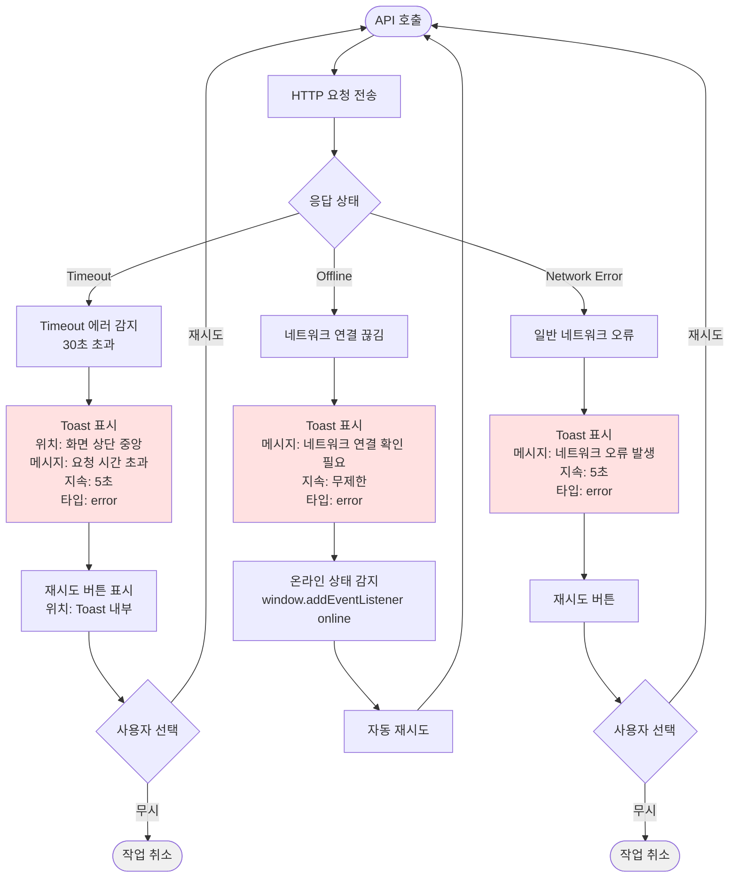

**복구 경로**:
1. **Timeout**: 재시도 버튼 → 동일 요청 재전송
2. **Offline**: 온라인 복구 감지 → 자동 재시도
3. **Network Error**: 재시도 버튼 → 사용자 선택

**사용자 피드백**:
- **Toast 위치**: 화면 상단 중앙
- **Toast 스타일**: 빨간 배경 (#FEE2E2), 빨간 아이콘
- **Toast 지속시간**: 5초 (Offline은 무제한)
- **액션 버튼**: "다시 시도" (파란 텍스트)

### 8.2. 인증 에러 처리

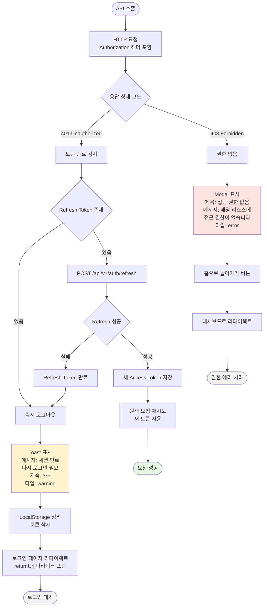

**복구 경로**:
1. **401 + Refresh Token 있음**: 자동 토큰 갱신 → 원래 요청 재시도
2. **401 + Refresh Token 없음**: 로그아웃 → 로그인 페이지 (returnUrl 포함)
3. **403**: Modal 표시 → 홈으로 리다이렉트

**사용자 피드백**:
- **401 Toast**: 노란 배경 (#FEF3C7), 경고 아이콘, 3초
- **403 Modal**: 중앙 모달, 빨간 아이콘, "홈으로 돌아가기" 버튼

### 8.3. 입력 검증 에러 처리

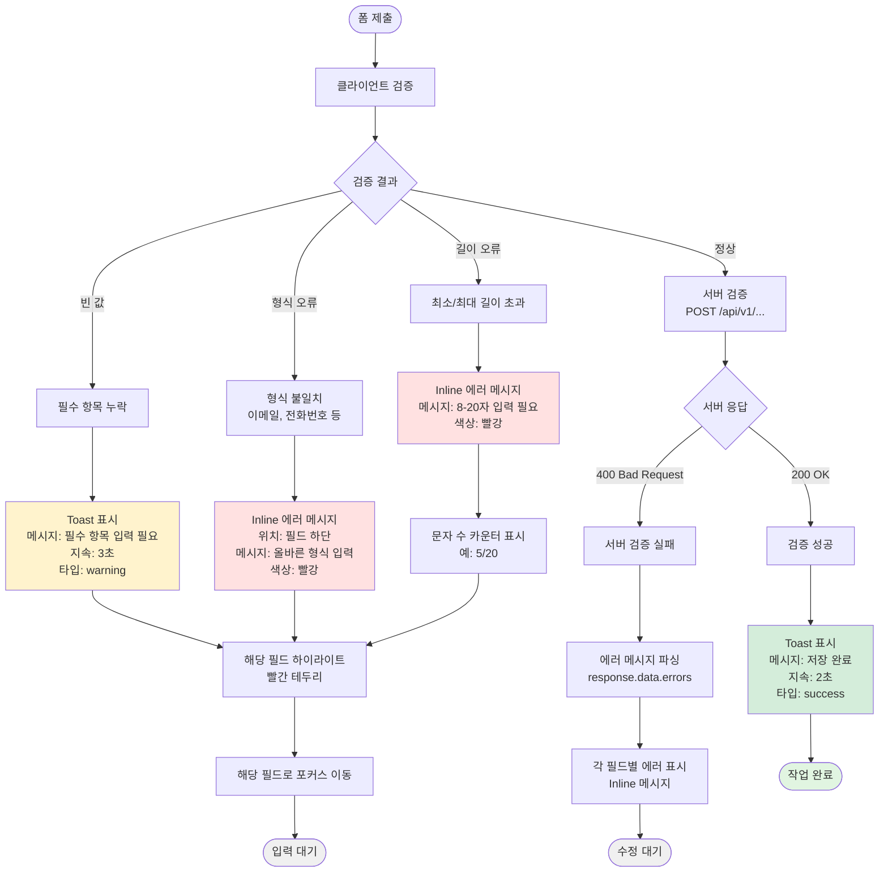

**복구 경로**:
1. **빈 값**: Toast + 필드 하이라이트 + 포커스 이동
2. **형식 오류**: Inline 에러 + 필드 하이라이트
3. **길이 오류**: Inline 에러 + 문자 수 카운터
4. **서버 검증 실패**: 각 필드별 Inline 에러 표시

**사용자 피드백**:
- **Toast**: 화면 상단, 노란 배경, 3초
- **Inline 에러**: 필드 하단, 빨간 텍스트, 아이콘
- **필드 하이라이트**: 빨간 테두리 (2px solid #EF4444)
- **포커스**: 자동 스크롤 + 포커스

### 8.4. 파일 업로드 에러 처리

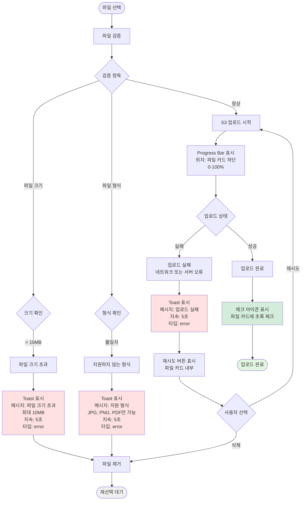

**복구 경로**:
1. **파일 크기 초과**: Toast + 파일 제거 → 재선택
2. **형식 불일치**: Toast + 파일 제거 → 재선택
3. **업로드 실패**: Toast + 재시도 버튼 → 재업로드 또는 삭제

**사용자 피드백**:
- **Toast**: 빨간 배경, 에러 아이콘, 5초
- **Progress Bar**: 파일 카드 하단, 파란 진행 바
- **재시도 버튼**: 파일 카드 내부, 작은 버튼
- **성공 아이콘**: 초록 체크 마크

### 8.5. 데이터 로드 에러 처리

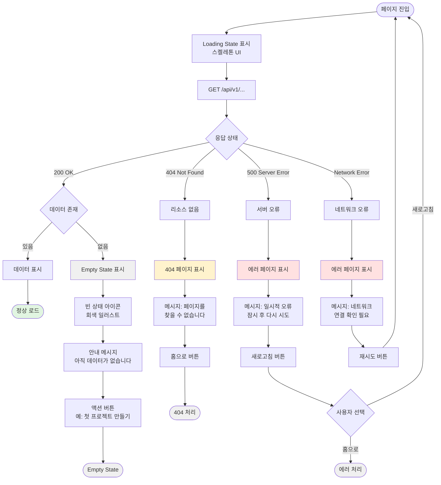

**복구 경로**:
1. **Empty State**: 안내 메시지 + 액션 버튼 (데이터 생성)
2. **404**: 404 페이지 + 홈으로 버튼
3. **500**: 에러 페이지 + 새로고침 버튼
4. **Network Error**: 에러 페이지 + 재시도 버튼

**사용자 피드백**:
- **Empty State**: 회색 일러스트, 안내 텍스트, 파란 액션 버튼
- **404 페이지**: 노란 배경, 404 일러스트, 홈 버튼
- **에러 페이지**: 빨간 배경, 에러 일러스트, 새로고침 버튼

### 8.6. 사용자 피드백 컴포넌트 명세

#### Toast 컴포넌트
```typescript
interface ToastProps {
  type: 'success' | 'error' | 'warning' | 'info';
  message: string;
  duration: number; // ms, 0 = 무제한
  position: 'top-center' | 'top-right' | 'bottom-center';
  action?: {
    label: string;
    onClick: () => void;
  };
}

// 스타일 정의
const toastStyles = {
  success: { bg: '#D4EDDA', icon: 'CheckCircle', color: '#155724' },
  error: { bg: '#FEE2E2', icon: 'XCircle', color: '#991B1B' },
  warning: { bg: '#FEF3C7', icon: 'AlertTriangle', color: '#92400E' },
  info: { bg: '#DBEAFE', icon: 'Info', color: '#1E40AF' }
};
```

#### Modal 컴포넌트
```typescript
interface ModalProps {
  type: 'confirm' | 'alert' | 'error';
  title: string;
  message: string;
  primaryAction: {
    label: string;
    onClick: () => void;
  };
  secondaryAction?: {
    label: string;
    onClick: () => void;
  };
}
```

#### Inline Error 컴포넌트
```typescript
interface InlineErrorProps {
  fieldId: string;
  message: string;
  icon?: boolean;
}

// 스타일
const inlineErrorStyle = {
  color: '#EF4444',
  fontSize: '14px',
  marginTop: '4px',
  display: 'flex',
  alignItems: 'center',
  gap: '4px'
};
```

---

## 8. 모바일 플로우 차이점

### 8.1. 네비게이션

- **Desktop:** 상단 GNB (항상 표시)
- **Mobile:** 햄버거 메뉴 (사이드 드로어)

### 8.2. 커리큘럼 플래너

- **Desktop:** 드래그 앤 드롭
- **Mobile:** 과목 탭 → 학기 선택 → 추가 버튼

### 8.3. 프로젝트 갤러리

- **Desktop:** 3열 그리드
- **Mobile:** 1열 리스트 (무한 스크롤)

---

## 부록: 플로우 다이어그램 도구

본 문서의 플로우를 시각화하려면 다음 도구를 사용하세요:

- **Figma:** 와이어프레임 및 프로토타입
- **Miro:** 사용자 여정 맵
- **Lucidchart:** 플로우차트


## 9. 마이크로 인터랙션 정의

### 9.1. 버튼 인터랙션

#### 기본 버튼
- **Hover**: 배경색 10% 어두워짐, 0.2초 transition
- **Active**: 배경색 20% 어두워짐, scale(0.98)
- **Disabled**: 불투명도 50%, cursor: not-allowed
- **Loading**: 스피너 아이콘 회전, 텍스트 "처리 중..."

#### 아이콘 버튼
- **Hover**: 배경 원형 표시 (rgba(0,0,0,0.05)), scale(1.1)
- **Active**: 배경 원형 진하게 (rgba(0,0,0,0.1)), scale(0.95)
- **Ripple Effect**: 클릭 시 물결 효과 (Material Design)

### 9.2. 입력 필드 인터랙션

#### Text Input
- **Focus**: 테두리 색상 파란색 (#3B82F6), 2px, 0.2초 transition
- **Blur**: 테두리 회색 (#D1D5DB), 1px
- **Error**: 테두리 빨간색 (#EF4444), 흔들림 애니메이션 (shake)
- **Success**: 테두리 초록색 (#10B981), 체크 아이콘 표시

#### Dropdown
- **Open**: 드롭다운 메뉴 fade-in (0.2초), 위에서 아래로 slide
- **Close**: fade-out (0.15초)
- **Hover Item**: 배경색 회색 (#F3F4F6)
- **Selected Item**: 배경색 파란색 (#DBEAFE), 체크 아이콘

### 9.3. 드래그 앤 드롭 인터랙션

#### 드래그 시작
- **Grab**: cursor: grab → grabbing
- **Lift**: 카드 shadow 증가 (0 4px 12px rgba(0,0,0,0.15))
- **Opacity**: 원본 위치 불투명도 50%

#### 드래그 중
- **Ghost**: 드래그 중인 카드 따라다님, 약간 회전 (rotate(2deg))
- **Drop Zone Highlight**: 유효한 드롭 영역 파란 테두리 점선
- **Invalid Zone**: 빨간 테두리, cursor: not-allowed

#### 드롭
- **Success**: 카드 부드럽게 배치 (0.3초 ease-out), 초록 플래시
- **Fail**: 카드 원위치 복귀 (0.3초 ease-in-out), 흔들림

### 9.4. 로딩 상태 인터랙션

#### 스켈레톤 UI
- **애니메이션**: 좌→우 shimmer 효과 (1.5초 반복)
- **색상**: 배경 #F3F4F6, shimmer #E5E7EB
- **형태**: 실제 콘텐츠 레이아웃과 동일

#### Progress Bar
- **진행**: 0-100% 부드러운 증가 (0.3초 transition)
- **색상**: 파란색 (#3B82F6)
- **완료**: 초록색 (#10B981), 체크 아이콘

#### Spinner
- **회전**: 360도 무한 회전 (1초)
- **색상**: 파란색 (#3B82F6)
- **크기**: 작음 16px, 중간 24px, 큰 32px

### 9.5. 피드백 인터랙션

#### Toast 등장/퇴장
- **등장**: 위에서 slide-down (0.3초 ease-out)
- **퇴장**: fade-out + slide-up (0.2초 ease-in)
- **자동 닫기**: duration 후 자동 퇴장

#### Modal 등장/퇴장
- **등장**: 배경 fade-in (0.2초), 모달 scale(0.95 → 1) + fade-in (0.3초)
- **퇴장**: 역순 애니메이션 (0.2초)
- **배경 클릭**: 모달 흔들림 (shake) + 닫기

#### Tooltip
- **등장**: fade-in (0.15초), 약간 위로 이동 (translateY(-4px))
- **퇴장**: fade-out (0.1초)
- **위치**: 요소 상단 중앙, 화면 밖이면 하단으로

### 9.6. 리스트 인터랙션

#### 카드 Hover
- **효과**: shadow 증가 (0 4px 12px rgba(0,0,0,0.1)), 약간 위로 (translateY(-4px))
- **Transition**: 0.2초 ease-out

#### 무한 스크롤
- **트리거**: 하단 200px 도달 시 다음 페이지 로드
- **로딩**: 하단에 스피너 표시
- **완료**: 새 항목 fade-in (0.3초)

#### 필터 적용
- **애니메이션**: 기존 항목 fade-out (0.2초) → 새 항목 fade-in (0.3초)
- **Empty State**: 필터 결과 없을 시 fade-in (0.3초)

### 9.7. 네비게이션 인터랙션

#### 페이지 전환
- **효과**: fade-out (0.15초) → fade-in (0.2초)
- **스크롤**: 새 페이지 최상단으로 부드럽게 이동

#### 탭 전환
- **효과**: 콘텐츠 fade-out (0.1초) → fade-in (0.2초)
- **인디케이터**: 선택된 탭 하단 바 slide (0.3초 ease-out)

#### 아코디언
- **열기**: height 0 → auto, 0.3초 ease-out
- **닫기**: height auto → 0, 0.2초 ease-in
- **아이콘**: 화살표 rotate(0deg → 180deg)

## 10. 이탈 지점 분석 및 개선 방안

### 10.1. 회원가입 플로우 이탈 지점

#### 이탈 지점 1: 회원가입 폼 (예상 이탈률 30%)
**원인**:
- 입력 항목 과다 (8개 필드)
- 학번, 전공 등 민감 정보 요구
- 비밀번호 복잡도 요구사항 불명확

**개선 방안**:
1. **단계별 입력**: 3단계로 분할 (기본 정보 → 학적 정보 → 관심 트랙)
2. **진행 표시**: Progress Bar 표시 (1/3, 2/3, 3/3)
3. **실시간 검증**: 입력 즉시 유효성 피드백
4. **비밀번호 강도 표시**: 시각적 강도 미터 (약함/보통/강함)
5. **소셜 로그인**: Google, Kakao 간편 가입 옵션

**측정 지표**:
- 폼 시작 → 완료 전환율
- 각 필드별 이탈률
- 평균 작성 시간

#### 이탈 지점 2: 이메일 중복 에러 (예상 이탈률 15%)
**원인**:
- 이미 가입한 사실 인지 못함
- 에러 후 재입력 번거로움

**개선 방안**:
1. **실시간 중복 체크**: 이메일 입력 후 blur 시 즉시 확인
2. **로그인 유도**: "이미 가입하셨나요? 로그인하기" 링크
3. **비밀번호 찾기**: 중복 에러 시 비밀번호 재설정 옵션

**측정 지표**:
- 중복 에러 발생 후 로그인 전환율
- 중복 에러 후 재가입 시도율

### 10.2. 커리큘럼 플래너 이탈 지점

#### 이탈 지점 3: 빈 플래너 화면 (예상 이탈률 40%)
**원인**:
- 8학기 빈 그리드가 압도적
- 어디서부터 시작해야 할지 모름
- 과목 검색 방법 불명확

**개선 방안**:
1. **온보딩 투어**: 첫 방문 시 인터랙티브 가이드 (3단계)
2. **추천 과목**: 트랙별 필수 과목 자동 제안
3. **템플릿 제공**: "선배 플랜 가져오기" 버튼 강조
4. **비디오 튜토리얼**: 우측 상단에 "사용법 보기" 링크
5. **Quick Start**: "AI 추천 플랜 생성" 버튼 (베타)

**측정 지표**:
- 빈 플래너 → 첫 과목 배치 전환율
- 온보딩 투어 완료율
- 템플릿 사용률

#### 이탈 지점 4: 유효성 검사 에러 (예상 이탈률 25%)
**원인**:
- 선수과목 미이수 에러 반복
- 학점 초과 에러 이해 어려움
- 에러 해결 방법 불명확

**개선 방안**:
1. **스마트 제안**: 선수과목 미이수 시 "먼저 이수해야 할 과목" 표시
2. **자동 조정**: 학점 초과 시 "다른 학기로 이동" 버튼
3. **시각적 피드백**: 에러 과목 빨간 테두리 + Tooltip 상세 설명
4. **도움말 링크**: 에러 메시지에 "자세히 보기" 링크

**측정 지표**:
- 에러 발생 후 해결 성공률
- 에러 발생 후 이탈률
- 평균 에러 해결 시간

### 10.3. 프로젝트 업로드 플로우 이탈 지점

#### 이탈 지점 5: Step 2 미디어 업로드 (예상 이탈률 35%)
**원인**:
- 파일 업로드 시간 오래 걸림
- 업로드 실패 시 재시도 번거로움
- 썸네일 필수 요구사항 부담

**개선 방안**:
1. **임시 저장**: 각 Step 완료 시 자동 임시 저장
2. **백그라운드 업로드**: 다음 Step 진행 중 백그라운드 업로드
3. **Progress 표시**: 각 파일별 업로드 진행률 표시
4. **썸네일 생성**: 동영상 업로드 시 자동 썸네일 추출
5. **나중에 추가**: "미디어 나중에 추가" 옵션

**측정 지표**:
- Step 2 완료율
- 평균 업로드 시간
- 업로드 실패율

#### 이탈 지점 6: Step 5 본문 작성 (예상 이탈률 20%)
**원인**:
- Markdown 문법 생소함
- 긴 본문 작성 부담
- 작성 중 데이터 손실 우려

**개선 방안**:
1. **WYSIWYG 에디터**: Markdown + 비주얼 에디터 토글
2. **템플릿 제공**: "프로젝트 소개 템플릿" 버튼
3. **자동 저장**: 30초마다 LocalStorage 자동 저장
4. **AI 요약**: "AI로 요약 생성" 버튼 (베타)
5. **최소 길이 제거**: 본문 최소 길이 요구사항 제거

**측정 지표**:
- Step 5 완료율
- 평균 작성 시간
- 자동 저장 복구 사용률

### 10.4. 로그인 플로우 이탈 지점

#### 이탈 지점 7: 로그인 실패 (예상 이탈률 20%)
**원인**:
- 비밀번호 기억 못함
- 이메일 오타
- 계정 잠금

**개선 방안**:
1. **비밀번호 표시**: "비밀번호 보기" 아이콘
2. **자동 완성**: 브라우저 자동 완성 지원
3. **비밀번호 찾기**: 로그인 폼 하단에 명확히 표시
4. **소셜 로그인**: Google, Kakao 간편 로그인
5. **이메일 제안**: 오타 감지 시 "혹시 @ajou.ac.kr?" 제안

**측정 지표**:
- 로그인 실패 후 재시도율
- 비밀번호 찾기 사용률
- 소셜 로그인 사용률

### 10.5. 전체 플로우 개선 전략

#### 공통 개선 방안
1. **진행 상태 저장**: 모든 플로우에서 중간 저장 지원
2. **명확한 CTA**: 다음 액션 버튼 명확히 표시
3. **에러 복구**: 모든 에러에 명확한 복구 경로 제공
4. **도움말**: 각 화면에 컨텍스트 도움말 제공
5. **피드백 수집**: 이탈 시점에 "어려운 점이 있나요?" 설문

#### 측정 및 모니터링
```typescript
// 이탈 지점 추적 이벤트
interface DropOffEvent {
  flowName: string;        // 'signup', 'curriculum', 'project_upload'
  stepName: string;        // 'step_1', 'step_2', etc.
  action: 'enter' | 'exit' | 'error';
  timestamp: Date;
  userId?: string;
  sessionId: string;
  errorType?: string;
}

// 개선 효과 측정 지표
interface FlowMetrics {
  flowName: string;
  totalStarts: number;
  totalCompletions: number;
  conversionRate: number;  // completions / starts
  avgDuration: number;     // 평균 소요 시간 (초)
  dropOffPoints: {
    stepName: string;
    dropOffRate: number;   // 해당 단계 이탈률
  }[];
}
```

---

## 부록: 플로우 개선 체크리스트

### 명사형 종결 적용 확인
- [x] 모든 섹션 제목 명사형 전환
- [x] 설명 문장 명사형 종결
- [x] 기술 명세 명사형 표현

### Mermaid 다이어그램 완성도
- [x] 주요 사용자 여정 5개 다이어그램 작성
- [x] 의사결정 분기 명확히 표현
- [x] 예외 처리 경로 포함
- [x] 색상 코딩 (성공/에러/경고)

### 의사결정 분기 명확성
- [x] 각 분기점 조건 명시
- [x] 각 경로 결과 정의
- [x] 조건 검증 로직 포함

### 예외 처리 완전성
- [x] 네트워크 에러 처리
- [x] 인증 에러 처리
- [x] 입력 검증 에러 처리
- [x] 파일 업로드 에러 처리
- [x] 데이터 로드 에러 처리
- [x] 사용자 피드백 컴포넌트 명세

### 마이크로 인터랙션 정의
- [x] 버튼 인터랙션
- [x] 입력 필드 인터랙션
- [x] 드래그 앤 드롭 인터랙션
- [x] 로딩 상태 인터랙션
- [x] 피드백 인터랙션
- [x] 리스트 인터랙션
- [x] 네비게이션 인터랙션

### 이탈 지점 분석
- [x] 회원가입 플로우 이탈 지점 2개
- [x] 커리큘럼 플래너 이탈 지점 2개
- [x] 프로젝트 업로드 이탈 지점 2개
- [x] 로그인 플로우 이탈 지점 1개
- [x] 각 이탈 지점별 개선 방안 제시
- [x] 측정 지표 정의
