# User Flow

> **Media Weave** 사용자 플로우 최종 구현 문서
> 
> 본 문서는 실제 구현된 시스템의 사용자 시나리오별 화면 전환 및 인터랙션 흐름을 정의합니다.

---

## 1. 사용자 플로우 개요 (User Flow Overview)

### 1.1. 구현된 주요 사용자 여정 (Implemented User Journeys)

1. **신규 사용자 온보딩** - 회원가입부터 대시보드 진입까지
2. **커리큘럼 관리** - 트랙 로드맵 탐색, 플래너 작성, 갤러리 공유
3. **프로젝트 관리** - 프로젝트 업로드, 갤러리 탐색, 좋아요/댓글
4. **팀 빌딩** - 팀원 모집글 작성 및 지원
5. **성적 관리** - OCR 기반 성적표 업로드 및 분석
6. **프로필 관리** - 개인 프로필, 프로젝트 관리, 채팅

### 1.2. 실제 구현된 사용자 역할

| 사용자 역할 | 주요 목표 | 구현된 핵심 기능 |
|------------|----------|----------|
| **STUDENT** | 학습 계획 수립 및 포트폴리오 구축 | 커리큘럼 플래너, 프로젝트 갤러리, 팀 빌딩 |
| **PROFESSOR** | 학생 활동 모니터링 | 프로젝트 갤러리 조회, 관리자 기능 |
| **ADMIN** | 시스템 관리 | 사용자 관리, 데이터 관리, 시스템 모니터링 |

---

## 2. 신규 사용자 온보딩 플로우

### 2.1. 회원가입 플로우 (실제 구현)

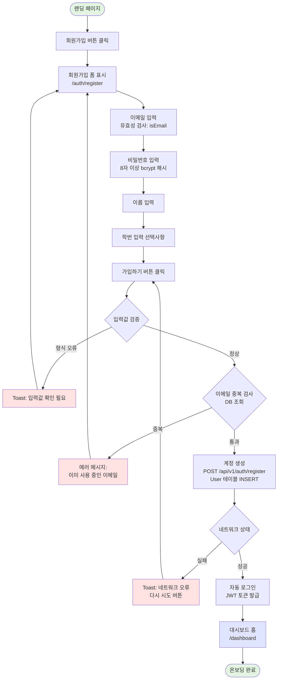
```mermaid
flowchart TD
    Start([랜딩 페이지]) --> SignupBtn[회원가입 버튼 클릭]
    SignupBtn --> Form[회원가입 폼 표시<br/>/auth/register]
    
    Form --> InputEmail[이메일 입력<br/>유효성 검사: isEmail]
    InputEmail --> InputPwd[비밀번호 입력<br/>8자 이상 bcrypt 해시]
    InputPwd --> InputName[이름 입력]
    InputName --> InputStudentId[학번 입력 선택사항]
    InputStudentId --> Submit[가입하기 버튼 클릭]
    
    Submit --> Validate{입력값 검증}
    Validate -->|형식 오류| ValidationError[Toast: 입력값 확인 필요]
    ValidationError --> Form
    
    Validate -->|정상| DupCheck{이메일 중복 검사<br/>DB 조회}
    DupCheck -->|중복| DupError[에러 메시지:<br/>이미 사용 중인 이메일]
    DupError --> Form
    
    DupCheck -->|통과| CreateAccount[계정 생성<br/>POST /api/v1/auth/register<br/>User 테이블 INSERT]
    CreateAccount --> NetworkCheck{네트워크 상태}
    NetworkCheck -->|실패| NetworkError[Toast: 네트워크 오류<br/>다시 시도 버튼]
    NetworkError --> Submit
    
    NetworkCheck -->|성공| AutoLogin[자동 로그인<br/>JWT 토큰 발급]
    AutoLogin --> Dashboard[대시보드 홈<br/>/dashboard]
    Dashboard --> End([온보딩 완료])
    
    style Start fill:#e1f5e1
    style End fill:#e1f5e1
    style ValidationError fill:#ffe1e1
    style DupError fill:#ffe1e1
    style NetworkError fill:#ffe1e1
    style Dashboard fill:#e1e5ff
```

**실제 구현된 검증 로직**:
- **이메일 검증**: Sequelize validate.isEmail
- **비밀번호 해시**: bcrypt.hash (salt rounds: 10)
- **중복 검사**: User.findOne({ where: { email } })
- **자동 로그인**: 회원가입 성공 시 JWT 토큰 즉시 발급

### 2.2. 로그인 플로우 (실제 구현)

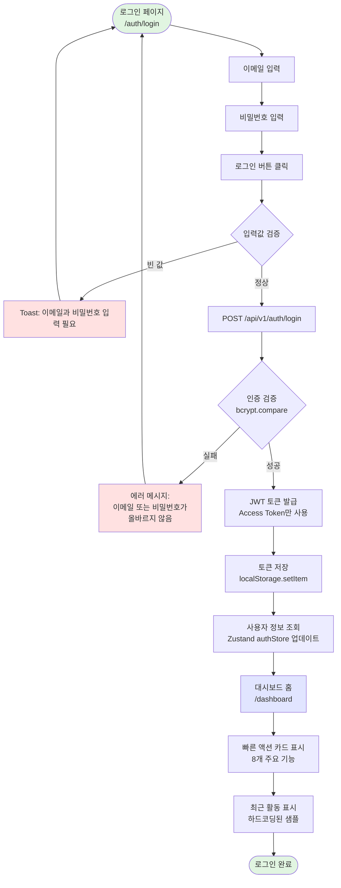
```mermaid
flowchart TD
    Start([로그인 페이지<br/>/auth/login]) --> InputEmail[이메일 입력]
    InputEmail --> InputPwd[비밀번호 입력]
    InputPwd --> LoginBtn[로그인 버튼 클릭]
    
    LoginBtn --> Validate{입력값 검증}
    Validate -->|빈 값| EmptyError[Toast: 이메일과 비밀번호 입력 필요]
    EmptyError --> Start
    
    Validate -->|정상| AuthAPI[POST /api/v1/auth/login]
    AuthAPI --> AuthCheck{인증 검증<br/>bcrypt.compare}
    
    AuthCheck -->|실패| AuthError[에러 메시지:<br/>이메일 또는 비밀번호가<br/>올바르지 않음]
    AuthError --> Start
    
    AuthCheck -->|성공| IssueToken[JWT 토큰 발급<br/>Access Token만 사용]
    IssueToken --> StoreToken[토큰 저장<br/>localStorage.setItem]
    StoreToken --> FetchUser[사용자 정보 조회<br/>Zustand authStore 업데이트]
    
    FetchUser --> Dashboard[대시보드 홈<br/>/dashboard]
    Dashboard --> LoadQuickActions[빠른 액션 카드 표시<br/>8개 주요 기능]
    LoadQuickActions --> LoadActivity[최근 활동 표시<br/>하드코딩된 샘플]
    LoadActivity --> End([로그인 완료])
    
    style Start fill:#e1f5e1
    style End fill:#e1f5e1
    style AuthError fill:#ffe1e1
    style EmptyError fill:#ffe1e1
    style Dashboard fill:#e1e5ff
```

**실제 구현된 인증 시스템**:
- **JWT 토큰**: Access Token만 사용 (Refresh Token 미구현)
- **토큰 저장**: localStorage에 'accessToken' 키로 저장
- **자동 로그아웃**: 401 응답 시 토큰 삭제 후 /auth/login 리다이렉트
- **상태 관리**: Zustand authStore로 로그인 상태 관리

### 2.3. 성적표 업로드 플로우 (OCR 기반)

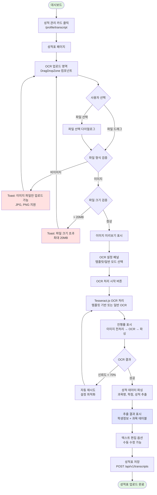
```mermaid
flowchart TD
    Start([대시보드]) --> TranscriptBtn[성적 관리 카드 클릭<br/>/profile/transcript]
    TranscriptBtn --> TranscriptPage[성적표 페이지]
    TranscriptPage --> UploadArea[OCR 업로드 영역<br/>DragDropZone 컴포넌트]
    
    UploadArea --> Choice{사용자 선택}
    Choice -->|파일 드래그| FileCheck{파일 형식 검증}
    Choice -->|파일 선택| FileSelect[파일 선택 다이얼로그]
    FileSelect --> FileCheck
    
    FileCheck -->|비이미지| FormatError[Toast: 이미지 파일만 업로드 가능<br/>JPG, PNG 지원]
    FormatError --> UploadArea
    
    FileCheck -->|이미지| SizeCheck{파일 크기 검증}
    SizeCheck -->|> 20MB| SizeError[Toast: 파일 크기 초과<br/>최대 20MB]
    SizeError --> UploadArea
    
    SizeCheck -->|정상| ShowPreview[이미지 미리보기 표시]
    ShowPreview --> OCRSettings[OCR 설정 패널<br/>템플릿/일반 모드 선택]
    OCRSettings --> StartOCR[OCR 처리 시작 버튼]
    
    StartOCR --> ProcessOCR[Tesseract.js OCR 처리<br/>템플릿 기반 또는 일반 OCR]
    ProcessOCR --> ShowProgress[진행률 표시<br/>이미지 전처리 → OCR → 파싱]
    ShowProgress --> OCRResult{OCR 결과}
    
    OCRResult -->|신뢰도 < 70%| RetryOCR[자동 재시도<br/>설정 최적화]
    RetryOCR --> ProcessOCR
    
    OCRResult -->|성공| ParseData[성적 데이터 파싱<br/>과목명, 학점, 성적 추출]
    ParseData --> ShowResult[추출 결과 표시<br/>학생정보 + 과목 테이블]
    ShowResult --> EditOption[텍스트 편집 옵션<br/>수동 수정 가능]
    EditOption --> SaveTranscript[성적표 저장<br/>POST /api/v1/transcripts]
    SaveTranscript --> End([성적표 업로드 완료])
    
    style Start fill:#e1f5e1
    style End fill:#e1f5e1
    style FormatError fill:#ffe1e1
    style SizeError fill:#ffe1e1
    style ShowResult fill:#e1e5ff
```

**실제 구현된 OCR 기능**:
- **템플릿 기반 OCR**: 성적표 구조 인식 후 영역별 처리
- **일반 OCR**: 전체 이미지 텍스트 추출
- **자동 재시도**: 신뢰도 70% 미만 시 설정 자동 최적화
- **이미지 전처리**: 대비, 밝기, 확대, 노이즈 제거 등
- **실시간 편집**: 추출된 텍스트 수동 편집 가능

---

## 3. 커리큘럼 관리 플로우

### 3.1. 트랙 로드맵 탐색 플로우 (ReactFlow 기반)

```mermaid
flowchart TD
    Start([대시보드]) --> NavClick[트랙 로드맵 클릭<br/>/curriculum/roadmap]
    NavClick --> LoadPage[트랙 로드맵 페이지 로드]
    
    LoadPage --> FetchData[CSV 데이터 로드<br/>Course.csv, Course_Prerequisites.csv]
    FetchData --> DataCheck{데이터 로드 상태}
    DataCheck -->|실패| LoadError[에러 화면:<br/>데이터 로드 실패<br/>새로고침 버튼]
    LoadError --> FetchData
    
    DataCheck -->|성공| ShowRoadmap[ReactFlow 로드맵 표시<br/>좌측: 트랙 필터<br/>중앙: 과목 노드 그래프]
    ShowRoadmap --> DefaultView[기본 뷰:<br/>모든 과목 노드 표시<br/>선수과목 연결선]
    
    DefaultView --> UserAction{사용자 액션}
    UserAction -->|트랙 필터 선택| SelectTrack[트랙 선택<br/>GI, VC, CD, MD, DE]
    SelectTrack --> UpdateGraph[그래프 업데이트<br/>trackColors.js 색상 적용]
    UpdateGraph --> HighlightNodes[선택 트랙 과목 강조<br/>불투명도 100%]
    HighlightNodes --> DimOthers[무관 과목 흐리게<br/>불투명도 30%]
    DimOthers --> ShowEdges[선수과목 연결선 표시<br/>실선: 필수 선수과목]
    ShowEdges --> UserAction
    
    UserAction -->|과목 노드 클릭| ShowModal[CourseDetailModal 표시]
    ShowModal --> LoadCourseDetail[과목 정보 표시<br/>CSV 데이터 기반]
    LoadCourseDetail --> DisplayInfo[과목명(한/영), 학점, 개설학기]
    DisplayInfo --> DisplayPrereq[선수과목 목록]
    DisplayPrereq --> DisplayDesc[과목 설명]
    
    DisplayDesc --> ModalAction{모달 내 액션}
    ModalAction -->|닫기| UserAction
    ModalAction -->|플래너에 추가| CheckAuth{로그인 상태}
    CheckAuth -->|비로그인| LoginPrompt[로그인 모달]
    LoginPrompt --> UserAction
    
    CheckAuth -->|로그인| Navigate[커리큘럼 플래너로 이동<br/>/curriculum/planner]
    Navigate --> ShowAdded[해당 과목이<br/>우측 과목 리스트에 하이라이트]
    ShowAdded --> End([탐색 완료])
    
    style Start fill:#e1f5e1
    style End fill:#e1f5e1
    style LoadError fill:#ffe1e1
    style ShowModal fill:#fff3cd
    style ShowAdded fill:#e1e5ff
```

**실제 구현된 기술 스택**:
- **ReactFlow**: 노드 기반 그래프 시각화
- **CSV 로더**: curriculumLoader.js로 정적 데이터 로드
- **트랙 색상**: trackColors.js로 일관된 색상 시스템
- **모달 시스템**: Portal.jsx 기반 중앙 집중식 모달

### 3.2. 커리큘럼 플래너 사용 플로우 (드래그앤드롭)

```mermaid
flowchart TD
    Start([커리큘럼 플래너<br/>/curriculum/planner]) --> LoadPlanner[PlannerBoard 컴포넌트 로드<br/>좌측: 8학기 그리드<br/>우측: 과목 리스트]
    LoadPlanner --> FetchData[과목 데이터 로드<br/>Zustand curriculumStore]
    FetchData --> Display[화면 표시<br/>DraggableCourse 컴포넌트]
    
    Display --> UserAction{사용자 액션}
    
    UserAction -->|검색| SearchCourse[과목 검색<br/>과목명/코드 필터링]
    SearchCourse --> FilterList[리스트 실시간 필터링]
    FilterList --> UserAction
    
    UserAction -->|드래그 시작| DragStart[@dnd-kit 드래그 시작<br/>DraggableCourse 컴포넌트]
    DragStart --> Dragging[드래그 중<br/>학기 그리드 드롭존 하이라이트]
    Dragging --> DropAction{드롭 위치}
    
    DropAction -->|그리드 외부| CancelDrag[드래그 취소<br/>원위치 복귀]
    CancelDrag --> UserAction
    
    DropAction -->|학기 그리드| ValidateDrop{유효성 검사<br/>선수과목, 학점, 개설학기}
    
    ValidateDrop -->|선수과목 미이수| PrereqError[빨간 테두리 + 경고 아이콘<br/>Tooltip: 선수과목 필요]
    PrereqError --> RevertDrop[배치 취소]
    RevertDrop --> UserAction
    
    ValidateDrop -->|학점 초과 21학점| CreditError[Toast: 학점 초과<br/>최대 21학점]
    CreditError --> RevertDrop
    
    ValidateDrop -->|개설 학기 불일치| SemesterWarning[노란 테두리 + 경고<br/>Tooltip: 개설 학기 확인]
    SemesterWarning --> PlaceCourse[과목 배치<br/>경고 상태]
    
    ValidateDrop -->|정상| PlaceSuccess[초록 테두리<br/>과목 배치 성공]
    
    PlaceCourse --> UpdateCredit[GraduationStatus 컴포넌트<br/>학기별 학점 계산]
    PlaceSuccess --> UpdateCredit
    UpdateCredit --> ShowCredit[각 학기 하단에<br/>총 학점 표시]
    ShowCredit --> AutoSave[Zustand store 자동 업데이트]
    AutoSave --> UserAction
    
    UserAction -->|저장 버튼| SaveModal[SaveCurriculumModal 표시]
    SaveModal --> InputTitle[플랜 제목 입력]
    InputTitle --> InputDesc[설명 입력 선택]
    InputDesc --> TogglePublic[공개 여부 토글]
    TogglePublic --> SaveBtn[저장 버튼 클릭]
    
    SaveBtn --> ValidateInput{입력값 검증}
    ValidateInput -->|제목 빈 값| TitleError[Toast: 제목 입력 필요]
    TitleError --> SaveModal
    
    ValidateInput -->|정상| SaveAPI[POST /api/v1/saved-curriculums<br/>SavedCurriculum 테이블]
    SaveAPI --> SaveCheck{저장 상태}
    SaveCheck -->|실패| SaveError[Toast: 저장 실패<br/>다시 시도]
    SaveError --> SaveModal
    
    SaveCheck -->|성공| SaveSuccess[Toast: 커리큘럼이<br/>저장되었습니다]
    SaveSuccess --> End([저장 완료])
    
    style Start fill:#e1f5e1
    style End fill:#e1f5e1
    style PrereqError fill:#ffe1e1
    style CreditError fill:#ffe1e1
    style SaveError fill:#ffe1e1
    style SemesterWarning fill:#fff3cd
    style PlaceSuccess fill:#d4edda
    style SaveSuccess fill:#d4edda
```

**실제 구현된 기술 스택**:
- **@dnd-kit**: 드래그앤드롭 라이브러리
- **Zustand**: 상태 관리 (curriculumStore)
- **실시간 검증**: 드롭 시 선수과목, 학점, 개설학기 검증
- **자동 저장**: LocalStorage + 서버 동기화

### 3.3. 커리큘럼 갤러리 플로우

```mermaid
flowchart TD
    Start([커리큘럼 갤러리<br/>/curriculum/gallery]) --> LoadGallery[공유된 커리큘럼 로드<br/>GET /api/v1/saved-curriculums/shared]
    LoadGallery --> ShowFilters[필터 옵션 표시<br/>트랙, 학년, 검색]
    ShowFilters --> ShowCards[카드형 리스트 표시<br/>작성자, 트랙, 학점 정보]
    
    ShowCards --> UserAction{사용자 액션}
    UserAction -->|필터 선택| ApplyFilter[필터 적용<br/>클라이언트 사이드 필터링]
    ApplyFilter --> UpdateList[리스트 업데이트]
    UpdateList --> UserAction
    
    UserAction -->|카드 클릭| ShowDetail[커리큘럼 상세 모달]
    ShowDetail --> DisplayPlan[8학기 플랜 시각화<br/>PlannerBoard 읽기 전용]
    DisplayPlan --> ShowAuthor[작성자 정보<br/>이름, 트랙, 학년]
    ShowAuthor --> ShowStats[통계 정보<br/>총 학점, 트랙별 분포]
    ShowStats --> CopyBtn[내 플래너로 복사하기 버튼]
    
    CopyBtn --> CheckAuth{로그인 상태}
    CheckAuth -->|비로그인| LoginPrompt[로그인 모달]
    LoginPrompt --> UserAction
    
    CheckAuth -->|로그인| CopyConfirm[복사 확인 모달<br/>"이 플랜을 가져오시겠습니까?"]
    CopyConfirm --> CopyAction{사용자 선택}
    CopyAction -->|취소| ShowDetail
    CopyAction -->|확인| CopyData[커리큘럼 데이터 복사<br/>Zustand store 업데이트]
    CopyData --> Navigate[커리큘럼 플래너로 이동]
    Navigate --> ShowCopied[복사된 플랜 표시<br/>하이라이트 효과]
    ShowCopied --> End([복사 완료])
    
    style Start fill:#e1f5e1
    style End fill:#e1f5e1
    style ShowDetail fill:#fff3cd
    style ShowCopied fill:#e1e5ff
```

**실제 구현된 기능**:
- **공유 시스템**: is_shared 플래그로 공개/비공개 관리
- **복사 기능**: 선배 플랜을 내 플래너로 즉시 복사
- **통계 표시**: 학점 분포, 트랙별 과목 수 등
- **필터링**: 트랙, 학년, 검색어 기반 실시간 필터링

---

## 4. 프로젝트 관리 플로우

### 4.1. 프로젝트 업로드 플로우 (실제 구현)

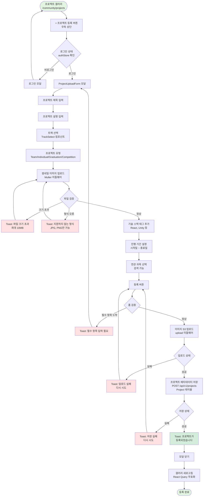
```mermaid
flowchart TD
    Start([프로젝트 갤러리<br/>/community/projects]) --> CreateBtn[+ 프로젝트 등록 버튼<br/>우측 상단]
    
    CreateBtn --> CheckAuth{로그인 상태<br/>authStore 확인}
    CheckAuth -->|비로그인| LoginModal[로그인 모달]
    LoginModal --> Start
    
    CheckAuth -->|로그인| UploadModal[ProjectUploadForm 모달]
    UploadModal --> InputTitle[프로젝트 제목 입력]
    InputTitle --> InputDesc[프로젝트 설명 입력]
    InputDesc --> SelectTrack[트랙 선택<br/>TrackSelect 컴포넌트]
    SelectTrack --> SelectType[프로젝트 유형<br/>Team/Individual/Graduation/Competition]
    SelectType --> UploadThumb[썸네일 이미지 업로드<br/>Multer 미들웨어]
    
    UploadThumb --> ValidateFile{파일 검증}
    ValidateFile -->|크기 초과| SizeError[Toast: 파일 크기 초과<br/>최대 10MB]
    SizeError --> UploadThumb
    ValidateFile -->|형식 오류| TypeError[Toast: 지원하지 않는 형식<br/>JPG, PNG만 가능]
    TypeError --> UploadThumb
    
    ValidateFile -->|정상| AddTags[기술 스택 태그 추가<br/>React, Unity 등]
    AddTags --> SetPeriod[진행 기간 설정<br/>시작일 ~ 종료일]
    SetPeriod --> SelectCourse[연관 과목 선택<br/>검색 가능]
    SelectCourse --> SubmitBtn[등록 버튼]
    
    SubmitBtn --> ValidateForm{폼 검증}
    ValidateForm -->|필수 항목 누락| FormError[Toast: 필수 항목 입력 필요]
    FormError --> UploadModal
    
    ValidateForm -->|정상| UploadS3[이미지 S3 업로드<br/>upload 미들웨어]
    UploadS3 --> S3Check{업로드 상태}
    S3Check -->|실패| UploadError[Toast: 업로드 실패<br/>다시 시도]
    UploadError --> SubmitBtn
    
    S3Check -->|성공| SaveDB[프로젝트 메타데이터 저장<br/>POST /api/v1/projects<br/>Project 테이블]
    SaveDB --> DBCheck{저장 상태}
    DBCheck -->|실패| SaveError[Toast: 저장 실패<br/>다시 시도]
    SaveError --> SubmitBtn
    
    DBCheck -->|성공| SuccessToast[Toast: 프로젝트가<br/>등록되었습니다]
    SuccessToast --> CloseModal[모달 닫기]
    CloseModal --> RefreshGallery[갤러리 새로고침<br/>React Query 무효화]
    RefreshGallery --> End([등록 완료])
    
    style Start fill:#e1f5e1
    style End fill:#e1f5e1
    style SizeError fill:#ffe1e1
    style TypeError fill:#ffe1e1
    style FormError fill:#ffe1e1
    style UploadError fill:#ffe1e1
    style SaveError fill:#ffe1e1
    style SuccessToast fill:#d4edda
```

**실제 구현된 기술 스택**:
- **파일 업로드**: Multer 미들웨어 + S3 저장
- **폼 검증**: React Hook Form + Zod 스키마
- **상태 관리**: React Query + Zustand
- **UI 컴포넌트**: TrackSelect, DragDropZone 등

### 4.2. 프로젝트 갤러리 탐색 플로우

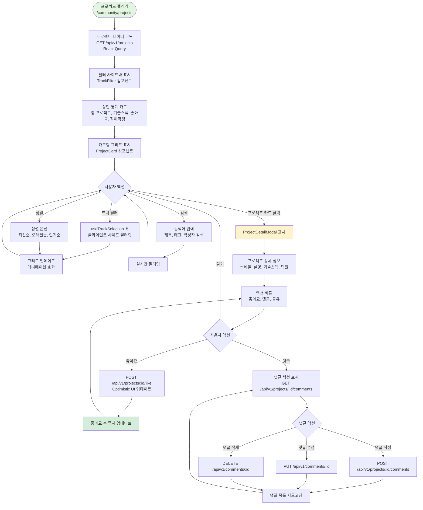
```mermaid
flowchart TD
    Start([프로젝트 갤러리<br/>/community/projects]) --> LoadGallery[프로젝트 데이터 로드<br/>GET /api/v1/projects<br/>React Query]
    LoadGallery --> ShowFilters[필터 사이드바 표시<br/>TrackFilter 컴포넌트]
    ShowFilters --> ShowStats[상단 통계 카드<br/>총 프로젝트, 기술스택, 좋아요, 참여학생]
    ShowStats --> ShowGrid[카드형 그리드 표시<br/>ProjectCard 컴포넌트]
    
    ShowGrid --> UserAction{사용자 액션}
    UserAction -->|트랙 필터| ApplyTrackFilter[useTrackSelection 훅<br/>클라이언트 사이드 필터링]
    ApplyTrackFilter --> UpdateGrid[그리드 업데이트<br/>애니메이션 효과]
    UpdateGrid --> UserAction
    
    UserAction -->|검색| SearchProject[검색어 입력<br/>제목, 태그, 작성자 검색]
    SearchProject --> FilterResults[실시간 필터링]
    FilterResults --> UserAction
    
    UserAction -->|정렬| SortProjects[정렬 옵션<br/>최신순, 오래된순, 인기순]
    SortProjects --> UpdateGrid
    
    UserAction -->|프로젝트 카드 클릭| ShowDetail[ProjectDetailModal 표시]
    ShowDetail --> LoadDetail[프로젝트 상세 정보<br/>썸네일, 설명, 기술스택, 팀원]
    LoadDetail --> ShowActions[액션 버튼<br/>좋아요, 댓글, 공유]
    
    ShowActions --> ActionChoice{사용자 액션}
    ActionChoice -->|좋아요| ToggleLike[POST /api/v1/projects/:id/like<br/>Optimistic UI 업데이트]
    ToggleLike --> UpdateLikeCount[좋아요 수 즉시 업데이트]
    UpdateLikeCount --> ShowActions
    
    ActionChoice -->|댓글| ShowComments[댓글 섹션 표시<br/>GET /api/v1/projects/:id/comments]
    ShowComments --> CommentActions{댓글 액션}
    CommentActions -->|댓글 작성| AddComment[POST /api/v1/projects/:id/comments]
    CommentActions -->|댓글 수정| EditComment[PUT /api/v1/comments/:id]
    CommentActions -->|댓글 삭제| DeleteComment[DELETE /api/v1/comments/:id]
    AddComment --> RefreshComments[댓글 목록 새로고침]
    EditComment --> RefreshComments
    DeleteComment --> RefreshComments
    RefreshComments --> ShowComments
    
    ActionChoice -->|닫기| UserAction
    
    style Start fill:#e1f5e1
    style ShowDetail fill:#fff3cd
    style UpdateLikeCount fill:#d4edda
```

**실제 구현된 커뮤니티 기능**:
- **좋아요 시스템**: Optimistic UI로 즉시 반영
- **댓글 시스템**: CRUD 완전 구현
- **조회수 추적**: ProjectView 테이블로 관리
- **실시간 필터링**: 클라이언트 사이드 성능 최적화

### 4.3. 내 프로젝트 관리 플로우

```mermaid
flowchart TD
    Start([프로필 메뉴<br/>/profile/projects]) --> LoadMyProjects[내 프로젝트 로드<br/>GET /api/v1/projects?user_id=me]
    LoadMyProjects --> ShowTabs[탭 인터페이스<br/>등록한 프로젝트, 좋아요한 프로젝트]
    ShowTabs --> ShowList[프로젝트 리스트 표시<br/>편집/삭제 버튼 포함]
    
    ShowList --> UserAction{사용자 액션}
    UserAction -->|편집| EditProject[ProjectUploadForm<br/>기존 데이터로 초기화]
    EditProject --> UpdateProject[PUT /api/v1/projects/:id<br/>수정된 데이터 저장]
    UpdateProject --> RefreshList[리스트 새로고침]
    RefreshList --> UserAction
    
    UserAction -->|삭제| ConfirmDelete[삭제 확인 모달<br/>"정말 삭제하시겠습니까?"]
    ConfirmDelete --> DeleteChoice{사용자 선택}
    DeleteChoice -->|취소| UserAction
    DeleteChoice -->|확인| DeleteProject[DELETE /api/v1/projects/:id<br/>S3 파일도 함께 삭제]
    DeleteProject --> DeleteCheck{삭제 상태}
    DeleteCheck -->|실패| DeleteError[Toast: 삭제 실패]
    DeleteError --> UserAction
    DeleteCheck -->|성공| DeleteSuccess[Toast: 삭제 완료]
    DeleteSuccess --> RefreshList
    
    UserAction -->|통계 보기| ShowStats[프로젝트 통계<br/>총 조회수, 좋아요, 댓글 수]
    ShowStats --> End([관리 완료])
    
    style Start fill:#e1f5e1
    style End fill:#e1f5e1
    style DeleteError fill:#ffe1e1
    style DeleteSuccess fill:#d4edda
```

**실제 구현된 관리 기능**:
- **CRUD 완전 지원**: 생성, 조회, 수정, 삭제
- **파일 관리**: S3 업로드/삭제 자동 처리
- **통계 대시보드**: 프로젝트별 성과 지표
- **권한 관리**: 본인 프로젝트만 수정/삭제 가능

---

## 5. 팀 빌딩 플로우

### 5.1. 팀원 모집 플로우 (실제 구현)

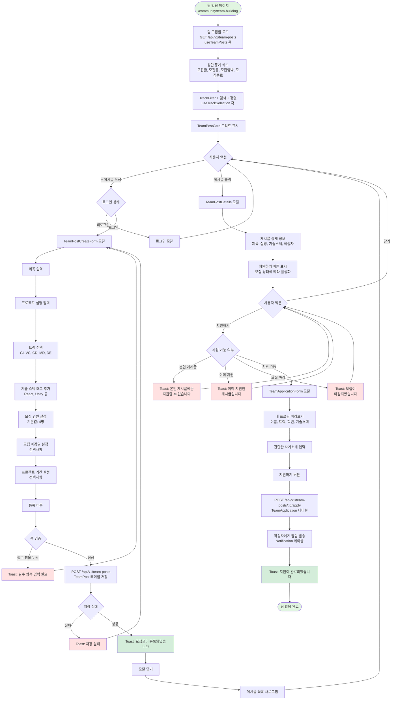
```mermaid
flowchart TD
    Start([팀 빌딩 페이지<br/>/community/team-building]) --> LoadPosts[팀 모집글 로드<br/>GET /api/v1/team-posts<br/>useTeamPosts 훅]
    LoadPosts --> ShowStats[상단 통계 카드<br/>모집글, 모집중, 모집임박, 모집종료]
    ShowStats --> ShowFilters[TrackFilter + 검색 + 정렬<br/>useTrackSelection 훅]
    ShowFilters --> ShowGrid[TeamPostCard 그리드 표시]
    
    ShowGrid --> UserAction{사용자 액션}
    UserAction -->|+ 게시글 작성| CheckAuth{로그인 상태}
    CheckAuth -->|비로그인| LoginModal[로그인 모달]
    LoginModal --> UserAction
    
    CheckAuth -->|로그인| CreateModal[TeamPostCreateForm 모달]
    CreateModal --> InputTitle[제목 입력]
    InputTitle --> InputDesc[프로젝트 설명 입력]
    InputDesc --> SelectTrack[트랙 선택<br/>GI, VC, CD, MD, DE]
    SelectTrack --> AddTags[기술 스택 태그 추가<br/>React, Unity 등]
    AddTags --> SetMembers[모집 인원 설정<br/>기본값: 4명]
    SetMembers --> SetDeadline[모집 마감일 설정<br/>선택사항]
    SetDeadline --> SetPeriod[프로젝트 기간 설정<br/>선택사항]
    SetPeriod --> SubmitPost[등록 버튼]
    
    SubmitPost --> ValidatePost{폼 검증}
    ValidatePost -->|필수 항목 누락| PostError[Toast: 필수 항목 입력 필요]
    PostError --> CreateModal
    
    ValidatePost -->|정상| SavePost[POST /api/v1/team-posts<br/>TeamPost 테이블 저장]
    SavePost --> SaveCheck{저장 상태}
    SaveCheck -->|실패| SaveError[Toast: 저장 실패]
    SaveError --> CreateModal
    SaveCheck -->|성공| PostSuccess[Toast: 모집글이 등록되었습니다]
    PostSuccess --> CloseModal[모달 닫기]
    CloseModal --> RefreshPosts[게시글 목록 새로고침]
    RefreshPosts --> UserAction
    
    UserAction -->|게시글 클릭| ShowDetail[TeamPostDetails 모달]
    ShowDetail --> LoadDetail[게시글 상세 정보<br/>제목, 설명, 기술스택, 작성자]
    LoadDetail --> ShowApplyBtn[지원하기 버튼 표시<br/>모집 상태에 따라 활성화]
    
    ShowApplyBtn --> DetailAction{사용자 액션}
    DetailAction -->|지원하기| ApplyCheck{지원 가능 여부}
    ApplyCheck -->|본인 게시글| SelfError[Toast: 본인 게시글에는<br/>지원할 수 없습니다]
    SelfError --> DetailAction
    ApplyCheck -->|이미 지원| DupError[Toast: 이미 지원한<br/>게시글입니다]
    DupError --> DetailAction
    ApplyCheck -->|모집 마감| ClosedError[Toast: 모집이<br/>마감되었습니다]
    ClosedError --> DetailAction
    
    ApplyCheck -->|지원 가능| ApplyModal[TeamApplicationForm 모달]
    ApplyModal --> ShowProfile[내 프로필 미리보기<br/>이름, 트랙, 학년, 기술스택]
    ShowProfile --> InputMessage[간단한 자기소개 입력]
    InputMessage --> SubmitApply[지원하기 버튼]
    SubmitApply --> SendApplication[POST /api/v1/team-posts/:id/apply<br/>TeamApplication 테이블]
    SendApplication --> NotifyAuthor[작성자에게 알림 발송<br/>Notification 테이블]
    NotifyAuthor --> ApplySuccess[Toast: 지원이 완료되었습니다]
    ApplySuccess --> End([팀 빌딩 완료])
    
    DetailAction -->|닫기| UserAction
    
    style Start fill:#e1f5e1
    style End fill:#e1f5e1
    style PostError fill:#ffe1e1
    style SaveError fill:#ffe1e1
    style SelfError fill:#ffe1e1
    style DupError fill:#ffe1e1
    style ClosedError fill:#ffe1e1
    style PostSuccess fill:#d4edda
    style ApplySuccess fill:#d4edda
```

**실제 구현된 팀 빌딩 시스템**:
- **모집글 관리**: TeamPost 테이블로 CRUD 완전 지원
- **지원 시스템**: TeamApplication 테이블로 지원자 관리
- **알림 시스템**: Notification 테이블로 실시간 알림
- **상태 관리**: OPEN/CLOSED 상태 + 마감일 자동 체크

### 5.2. 모집 상태 관리 플로우

```mermaid
flowchart TD
    Start([내가 작성한 모집글]) --> LoadMyPosts[내 모집글 조회<br/>GET /api/v1/team-posts?author_id=me]
    LoadMyPosts --> ShowManagement[관리 버튼 표시<br/>수정, 삭제, 모집마감, 지원자 보기]
    
    ShowManagement --> ManageAction{관리 액션}
    ManageAction -->|지원자 보기| LoadApplications[GET /api/v1/team-posts/:id/applications<br/>지원자 목록 조회]
    LoadApplications --> ShowApplicants[지원자 리스트 표시<br/>프로필, 자기소개, 지원일시]
    ShowApplicants --> ApplicantAction{지원자 관리}
    ApplicantAction -->|수락| AcceptApplicant[지원자 수락 처리]
    ApplicantAction -->|거절| RejectApplicant[지원자 거절 처리]
    AcceptApplicant --> NotifyApplicant[지원자에게 알림 발송]
    RejectApplicant --> NotifyApplicant
    NotifyApplicant --> ShowApplicants
    
    ManageAction -->|모집 마감| ConfirmClose[모집 마감 확인 모달<br/>"모집을 마감하시겠습니까?"]
    ConfirmClose --> CloseChoice{사용자 선택}
    CloseChoice -->|취소| ShowManagement
    CloseChoice -->|확인| UpdateStatus[PATCH /api/v1/team-posts/:id<br/>status: 'CLOSED']
    UpdateStatus --> StatusSuccess[Toast: 모집이 마감되었습니다]
    StatusSuccess --> UpdateUI[UI 업데이트<br/>[모집 마감] 뱃지 표시]
    UpdateUI --> ShowManagement
    
    ManageAction -->|수정| EditModal[TeamPostCreateForm<br/>기존 데이터로 초기화]
    EditModal --> UpdatePost[PUT /api/v1/team-posts/:id]
    UpdatePost --> EditSuccess[Toast: 수정이 완료되었습니다]
    EditSuccess --> ShowManagement
    
    ManageAction -->|삭제| ConfirmDelete[삭제 확인 모달<br/>"정말 삭제하시겠습니까?"]
    ConfirmDelete --> DeleteChoice{사용자 선택}
    DeleteChoice -->|취소| ShowManagement
    DeleteChoice -->|확인| DeletePost[DELETE /api/v1/team-posts/:id<br/>관련 지원서도 함께 삭제]
    DeletePost --> DeleteSuccess[Toast: 삭제가 완료되었습니다]
    DeleteSuccess --> End([관리 완료])
    
    style Start fill:#e1f5e1
    style End fill:#e1f5e1
    style StatusSuccess fill:#d4edda
    style EditSuccess fill:#d4edda
    style DeleteSuccess fill:#d4edda
```

**실제 구현된 관리 기능**:
- **지원자 관리**: 지원자 목록 조회, 수락/거절 처리
- **모집 상태**: OPEN/CLOSED 상태 관리
- **자동 마감**: recruitment_deadline 기반 자동 마감
- **알림 시스템**: 지원, 수락, 거절 시 실시간 알림

---

## 6. 포트폴리오 구축 플로우

### 6.1. 프로필 작성 플로우

```
[GNB - 프로필 아이콘]
    ↓ (드롭다운 메뉴)
    ↓ ("내 프로필" 클릭)
[프로필 페이지]
    ├─ 좌측: 프로필 정보
    │   ├─ 프로필 사진
    │   ├─ 이름, 학번
    │   ├─ 트랙, 학년
    │   ├─ 한 줄 소개
    │   └─ 외부 링크 (GitHub, LinkedIn)
    └─ 우측: 탭 영역
        ├─ Projects (내가 등록한 프로젝트)
        ├─ Posts (팀 빌딩 게시글)
        └─ Curriculums (커리큘럼 플랜)
    ↓ (우측 상단 [편집] 버튼)
[프로필 편집 모달]
    ├─ 프로필 사진 업로드
    ├─ 한 줄 소개 입력
    ├─ GitHub URL 입력
    ├─ LinkedIn URL 입력
    └─ [저장] 버튼
    ↓
[API 호출]
    └─ PATCH /api/v1/users/me/profile
    ↓
[프로필 페이지 새로고침]
    └─ 업데이트된 정보 표시
```

### 6.2. Markdown 프로필 업로드 플로우

```
[프로필 페이지]
    ↓ ([Markdown 업로드] 버튼)
[파일 선택 모달]
    ├─ .md 파일 선택
    └─ [업로드] 버튼
    ↓
[파일 업로드 & 파싱]
    ├─ 서버로 전송
    ├─ Markdown 파싱
    │   ├─ # 제목 → 이름
    │   ├─ ## About → 소개
    │   ├─ ## Projects → 프로젝트 목록
    │   └─ ## Skills → 기술 스택
    └─ 구조화된 데이터 생성
    ↓
[파싱 결과 미리보기]
    ├─ 추출된 정보 표시
    ├─ 수정 가능
    └─ [적용] 버튼
    ↓
[프로필 업데이트]
    └─ 파싱된 데이터로 프로필 자동 구성
```

### 6.3. 프로필 공유 플로우

```
[프로필 페이지]
    ↓ ([공유하기] 버튼)
[공유 모달]
    ├─ 프로필 URL 표시
    │   └─ https://mediaweave.ajou.ac.kr/profile/uuid
    ├─ [링크 복사] 버튼
    ├─ 소셜 공유 버튼 (카카오톡, 페이스북)
    └─ [PDF 다운로드] 버튼
    ↓ ([PDF 다운로드] 클릭)
[PDF 생성]
    ├─ 서버에서 프로필 데이터 기반 PDF 생성
    ├─ 이력서 형식으로 포맷팅
    └─ 다운로드 시작
```

---

## 7. 의사결정 분기 상세 정의

### 7.1. 인증 관련 분기

#### 로그인 상태 검증
**조건**: 사용자의 JWT 토큰 유효성 확인
- **로그인 상태**: 
  - 조건: `localStorage.getItem('accessToken')` 존재 및 만료 시간 유효
  - 결과: 요청한 기능 실행
- **비로그인 상태**: 
  - 조건: 토큰 없음 또는 만료
  - 결과: 로그인 모달 표시 → 로그인 후 원래 페이지로 복귀

#### 재시도 횟수 제한
**조건**: 로그인 실패 횟수 카운트
- **< 5회**: 
  - 조건: `failedAttempts < 5`
  - 결과: 에러 메시지 표시 + 재시도 허용
- **≥ 5회**: 
  - 조건: `failedAttempts >= 5`
  - 결과: 계정 일시 잠금 10분 + 잠금 안내 메시지

### 7.2. 파일 업로드 관련 분기

#### 파일 형식 검증
**조건**: 업로드된 파일의 MIME 타입 확인
- **CSV 파일**: 
  - 조건: `file.type === 'text/csv'`
  - 결과: 파싱 프로세스 진행
- **비CSV 파일**: 
  - 조건: `file.type !== 'text/csv'`
  - 결과: Toast 에러 메시지 + 파일 재선택

#### 파일 크기 검증
**조건**: 파일 크기 제한 확인
- **허용 범위 (≤ 10MB)**: 
  - 조건: `file.size <= 10 * 1024 * 1024`
  - 결과: 업로드 진행
- **초과 (> 10MB)**: 
  - 조건: `file.size > 10 * 1024 * 1024`
  - 결과: Toast 에러 + 파일 재선택

### 7.3. 유효성 검사 관련 분기

#### 선수과목 검증
**조건**: 배치하려는 과목의 선수과목 이수 여부 확인
- **선수과목 이수 완료**: 
  - 조건: `prerequisites.every(p => completedCourses.includes(p))`
  - 결과: 과목 배치 허용 + 초록 테두리
- **선수과목 미이수**: 
  - 조건: `prerequisites.some(p => !completedCourses.includes(p))`
  - 결과: 배치 취소 + 빨간 테두리 + 경고 Tooltip

#### 학점 초과 검증
**조건**: 학기별 총 학점 계산
- **정상 범위 (≤ 21학점)**: 
  - 조건: `semesterCredits <= 21`
  - 결과: 과목 배치 허용
- **초과 (> 21학점)**: 
  - 조건: `semesterCredits > 21`
  - 결과: 배치 취소 + Toast 경고

#### 개설 학기 검증
**조건**: 과목의 개설 학기와 배치 학기 일치 여부
- **일치**: 
  - 조건: `course.offeredSemester === targetSemester`
  - 결과: 정상 배치 + 초록 테두리
- **불일치**: 
  - 조건: `course.offeredSemester !== targetSemester`
  - 결과: 경고 배치 + 노란 테두리 + 경고 Tooltip

### 7.4. 네트워크 관련 분기

#### API 호출 상태
**조건**: HTTP 응답 상태 코드
- **성공 (200-299)**: 
  - 조건: `response.status >= 200 && response.status < 300`
  - 결과: 데이터 처리 및 화면 업데이트
- **클라이언트 에러 (400-499)**: 
  - 조건: `response.status >= 400 && response.status < 500`
  - 결과: 에러 메시지 표시 + 사용자 입력 수정 요청
- **서버 에러 (500-599)**: 
  - 조건: `response.status >= 500`
  - 결과: Toast 에러 + 재시도 버튼
- **네트워크 오류**: 
  - 조건: `error.message === 'Network Error'`
  - 결과: Toast 네트워크 오류 + 재시도 버튼

### 7.5. 데이터 상태 관련 분기

#### 검색 결과 존재 여부
**조건**: 검색 쿼리 결과 개수
- **결과 있음 (> 0)**: 
  - 조건: `searchResults.length > 0`
  - 결과: 결과 리스트 표시
- **결과 없음 (= 0)**: 
  - 조건: `searchResults.length === 0`
  - 결과: Empty State 표시 + 검색어 수정 제안

#### 과목 매칭 결과
**조건**: CSV 파싱 후 과목 매칭 성공률
- **전체 매칭 성공**: 
  - 조건: `matchedCourses.length === totalCourses`
  - 결과: 자동 배치 진행
- **부분 매칭 실패**: 
  - 조건: `matchedCourses.length < totalCourses`
  - 결과: 매칭 결과 화면 + 수동 매칭 옵션

### 7.6. 사용자 액션 관련 분기

#### 드래그 앤 드롭 위치
**조건**: 드롭 이벤트 발생 위치
- **학기 그리드 내부**: 
  - 조건: `dropTarget.classList.contains('semester-grid')`
  - 결과: 유효성 검사 진행
- **그리드 외부**: 
  - 조건: `!dropTarget.classList.contains('semester-grid')`
  - 결과: 드래그 취소 + 원위치 복귀

#### 모달 내 액션
**조건**: 사용자의 모달 내 버튼 클릭
- **확인/저장**: 
  - 조건: `button.action === 'confirm'`
  - 결과: 데이터 저장 및 모달 닫기
- **취소**: 
  - 조건: `button.action === 'cancel'`
  - 결과: 변경사항 폐기 및 모달 닫기
- **닫기 (X)**: 
  - 조건: `button.action === 'close'`
  - 결과: 변경사항 유지 여부 확인 → 모달 닫기

## 8. 예외 처리 경로 및 사용자 피드백

### 8.1. 네트워크 에러 처리

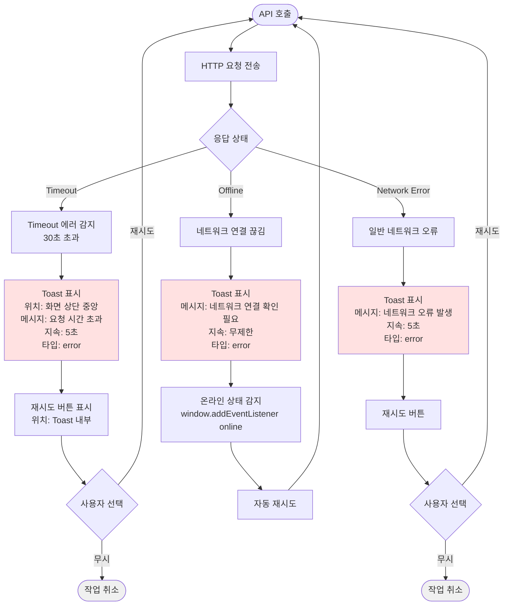
```mermaid
flowchart TD
    Start([API 호출]) --> Request[HTTP 요청 전송]
    Request --> Check{응답 상태}
    
    Check -->|Timeout| TimeoutError[Timeout 에러 감지<br/>30초 초과]
    TimeoutError --> TimeoutFeedback[Toast 표시<br/>위치: 화면 상단 중앙<br/>메시지: 요청 시간 초과<br/>지속: 5초<br/>타입: error]
    TimeoutFeedback --> RetryBtn1[재시도 버튼 표시<br/>위치: Toast 내부]
    RetryBtn1 --> UserChoice1{사용자 선택}
    UserChoice1 -->|재시도| Start
    UserChoice1 -->|무시| End1([작업 취소])
    
    Check -->|Offline| OfflineError[네트워크 연결 끊김]
    OfflineError --> OfflineFeedback[Toast 표시<br/>메시지: 네트워크 연결 확인 필요<br/>지속: 무제한<br/>타입: error]
    OfflineFeedback --> OnlineListener[온라인 상태 감지<br/>window.addEventListener online]
    OnlineListener --> AutoRetry[자동 재시도]
    AutoRetry --> Start
    
    Check -->|Network Error| NetworkError[일반 네트워크 오류]
    NetworkError --> NetworkFeedback[Toast 표시<br/>메시지: 네트워크 오류 발생<br/>지속: 5초<br/>타입: error]
    NetworkFeedback --> RetryBtn2[재시도 버튼]
    RetryBtn2 --> UserChoice2{사용자 선택}
    UserChoice2 -->|재시도| Start
    UserChoice2 -->|무시| End2([작업 취소])
    
    style TimeoutFeedback fill:#ffe1e1
    style OfflineFeedback fill:#ffe1e1
    style NetworkFeedback fill:#ffe1e1
    style End1 fill:#f0f0f0
    style End2 fill:#f0f0f0
```

**복구 경로**:
1. **Timeout**: 재시도 버튼 → 동일 요청 재전송
2. **Offline**: 온라인 복구 감지 → 자동 재시도
3. **Network Error**: 재시도 버튼 → 사용자 선택

**사용자 피드백**:
- **Toast 위치**: 화면 상단 중앙
- **Toast 스타일**: 빨간 배경 (#FEE2E2), 빨간 아이콘
- **Toast 지속시간**: 5초 (Offline은 무제한)
- **액션 버튼**: "다시 시도" (파란 텍스트)

### 8.2. 인증 에러 처리

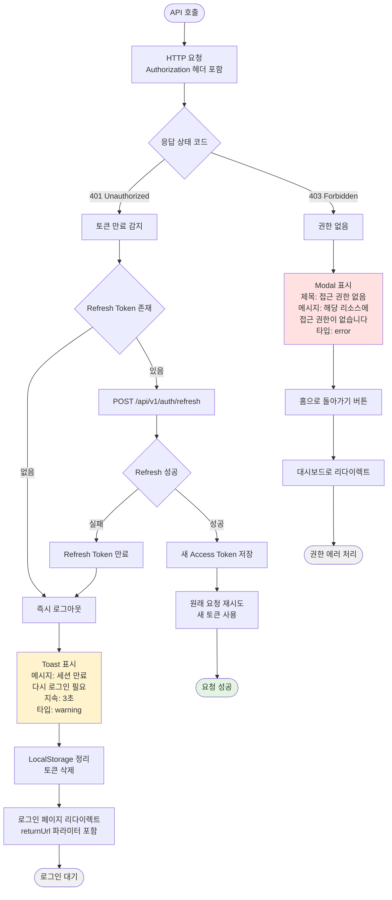
```mermaid
flowchart TD
    Start([API 호출]) --> Request[HTTP 요청<br/>Authorization 헤더 포함]
    Request --> Check{응답 상태 코드}
    
    Check -->|401 Unauthorized| TokenExpired[토큰 만료 감지]
    TokenExpired --> HasRefresh{Refresh Token 존재}
    
    HasRefresh -->|없음| DirectLogout[즉시 로그아웃]
    DirectLogout --> LogoutFeedback[Toast 표시<br/>메시지: 세션 만료<br/>다시 로그인 필요<br/>지속: 3초<br/>타입: warning]
    LogoutFeedback --> ClearStorage[LocalStorage 정리<br/>토큰 삭제]
    ClearStorage --> RedirectLogin[로그인 페이지 리다이렉트<br/>returnUrl 파라미터 포함]
    RedirectLogin --> End1([로그인 대기])
    
    HasRefresh -->|있음| RefreshAPI[POST /api/v1/auth/refresh]
    RefreshAPI --> RefreshCheck{Refresh 성공}
    
    RefreshCheck -->|실패| RefreshFailed[Refresh Token 만료]
    RefreshFailed --> DirectLogout
    
    RefreshCheck -->|성공| UpdateToken[새 Access Token 저장]
    UpdateToken --> RetryOriginal[원래 요청 재시도<br/>새 토큰 사용]
    RetryOriginal --> End2([요청 성공])
    
    Check -->|403 Forbidden| PermissionDenied[권한 없음]
    PermissionDenied --> PermissionFeedback[Modal 표시<br/>제목: 접근 권한 없음<br/>메시지: 해당 리소스에<br/>접근 권한이 없습니다<br/>타입: error]
    PermissionFeedback --> PermissionBtn[홈으로 돌아가기 버튼]
    PermissionBtn --> RedirectHome[대시보드로 리다이렉트]
    RedirectHome --> End3([권한 에러 처리])
    
    style LogoutFeedback fill:#fff3cd
    style PermissionFeedback fill:#ffe1e1
    style End1 fill:#f0f0f0
    style End2 fill:#e1f5e1
    style End3 fill:#f0f0f0
```

**복구 경로**:
1. **401 + Refresh Token 있음**: 자동 토큰 갱신 → 원래 요청 재시도
2. **401 + Refresh Token 없음**: 로그아웃 → 로그인 페이지 (returnUrl 포함)
3. **403**: Modal 표시 → 홈으로 리다이렉트

**사용자 피드백**:
- **401 Toast**: 노란 배경 (#FEF3C7), 경고 아이콘, 3초
- **403 Modal**: 중앙 모달, 빨간 아이콘, "홈으로 돌아가기" 버튼

### 8.3. 입력 검증 에러 처리

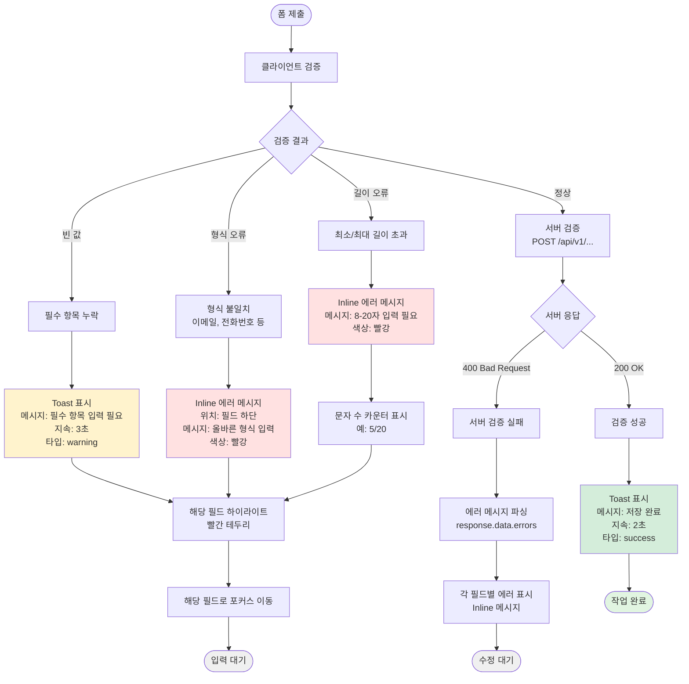
```mermaid
flowchart TD
    Start([폼 제출]) --> Validate[클라이언트 검증]
    Validate --> Check{검증 결과}
    
    Check -->|빈 값| EmptyError[필수 항목 누락]
    EmptyError --> EmptyFeedback[Toast 표시<br/>메시지: 필수 항목 입력 필요<br/>지속: 3초<br/>타입: warning]
    EmptyFeedback --> HighlightField[해당 필드 하이라이트<br/>빨간 테두리]
    HighlightField --> FocusField[해당 필드로 포커스 이동]
    FocusField --> End1([입력 대기])
    
    Check -->|형식 오류| FormatError[형식 불일치<br/>이메일, 전화번호 등]
    FormatError --> FormatFeedback[Inline 에러 메시지<br/>위치: 필드 하단<br/>메시지: 올바른 형식 입력<br/>색상: 빨강]
    FormatFeedback --> HighlightField
    
    Check -->|길이 오류| LengthError[최소/최대 길이 초과]
    LengthError --> LengthFeedback[Inline 에러 메시지<br/>메시지: 8-20자 입력 필요<br/>색상: 빨강]
    LengthFeedback --> ShowCounter[문자 수 카운터 표시<br/>예: 5/20]
    ShowCounter --> HighlightField
    
    Check -->|정상| ServerValidate[서버 검증<br/>POST /api/v1/...]
    ServerValidate --> ServerCheck{서버 응답}
    
    ServerCheck -->|400 Bad Request| ServerError[서버 검증 실패]
    ServerError --> ParseError[에러 메시지 파싱<br/>response.data.errors]
    ParseError --> ShowServerError[각 필드별 에러 표시<br/>Inline 메시지]
    ShowServerError --> End2([수정 대기])
    
    ServerCheck -->|200 OK| Success[검증 성공]
    Success --> SuccessFeedback[Toast 표시<br/>메시지: 저장 완료<br/>지속: 2초<br/>타입: success]
    SuccessFeedback --> End3([작업 완료])
    
    style EmptyFeedback fill:#fff3cd
    style FormatFeedback fill:#ffe1e1
    style LengthFeedback fill:#ffe1e1
    style SuccessFeedback fill:#d4edda
    style End1 fill:#f0f0f0
    style End2 fill:#f0f0f0
    style End3 fill:#e1f5e1
```

**복구 경로**:
1. **빈 값**: Toast + 필드 하이라이트 + 포커스 이동
2. **형식 오류**: Inline 에러 + 필드 하이라이트
3. **길이 오류**: Inline 에러 + 문자 수 카운터
4. **서버 검증 실패**: 각 필드별 Inline 에러 표시

**사용자 피드백**:
- **Toast**: 화면 상단, 노란 배경, 3초
- **Inline 에러**: 필드 하단, 빨간 텍스트, 아이콘
- **필드 하이라이트**: 빨간 테두리 (2px solid #EF4444)
- **포커스**: 자동 스크롤 + 포커스

### 8.4. 파일 업로드 에러 처리

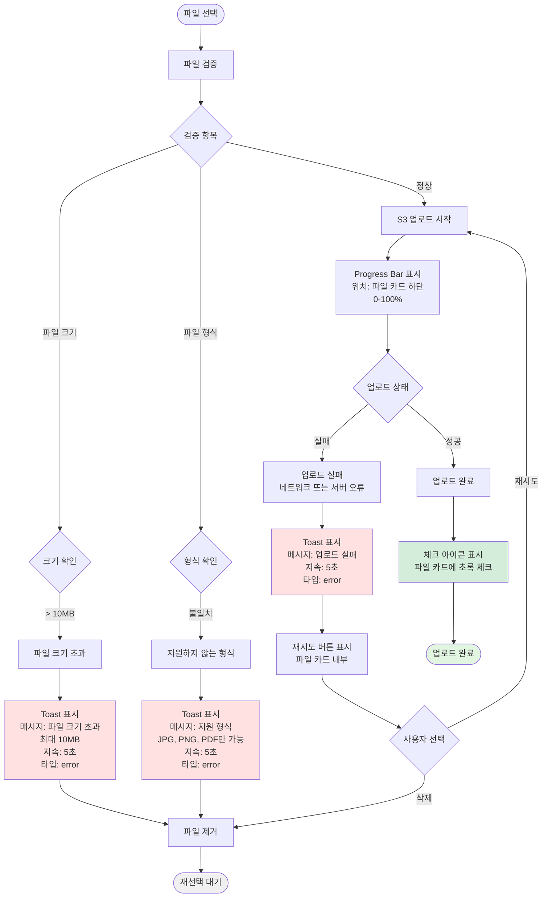
```mermaid
flowchart TD
    Start([파일 선택]) --> Validate[파일 검증]
    Validate --> Check{검증 항목}
    
    Check -->|파일 크기| SizeCheck{크기 확인}
    SizeCheck -->|> 10MB| SizeError[파일 크기 초과]
    SizeError --> SizeFeedback[Toast 표시<br/>메시지: 파일 크기 초과<br/>최대 10MB<br/>지속: 5초<br/>타입: error]
    SizeFeedback --> RemoveFile[파일 제거]
    RemoveFile --> End1([재선택 대기])
    
    Check -->|파일 형식| TypeCheck{형식 확인}
    TypeCheck -->|불일치| TypeError[지원하지 않는 형식]
    TypeError --> TypeFeedback[Toast 표시<br/>메시지: 지원 형식<br/>JPG, PNG, PDF만 가능<br/>지속: 5초<br/>타입: error]
    TypeFeedback --> RemoveFile
    
    Check -->|정상| Upload[S3 업로드 시작]
    Upload --> ShowProgress[Progress Bar 표시<br/>위치: 파일 카드 하단<br/>0-100%]
    ShowProgress --> UploadCheck{업로드 상태}
    
    UploadCheck -->|실패| UploadError[업로드 실패<br/>네트워크 또는 서버 오류]
    UploadError --> UploadFeedback[Toast 표시<br/>메시지: 업로드 실패<br/>지속: 5초<br/>타입: error]
    UploadFeedback --> RetryOption[재시도 버튼 표시<br/>파일 카드 내부]
    RetryOption --> UserChoice{사용자 선택}
    UserChoice -->|재시도| Upload
    UserChoice -->|삭제| RemoveFile
    
    UploadCheck -->|성공| UploadSuccess[업로드 완료]
    UploadSuccess --> SuccessIcon[체크 아이콘 표시<br/>파일 카드에 초록 체크]
    SuccessIcon --> End2([업로드 완료])
    
    style SizeFeedback fill:#ffe1e1
    style TypeFeedback fill:#ffe1e1
    style UploadFeedback fill:#ffe1e1
    style SuccessIcon fill:#d4edda
    style End1 fill:#f0f0f0
    style End2 fill:#e1f5e1
```

**복구 경로**:
1. **파일 크기 초과**: Toast + 파일 제거 → 재선택
2. **형식 불일치**: Toast + 파일 제거 → 재선택
3. **업로드 실패**: Toast + 재시도 버튼 → 재업로드 또는 삭제

**사용자 피드백**:
- **Toast**: 빨간 배경, 에러 아이콘, 5초
- **Progress Bar**: 파일 카드 하단, 파란 진행 바
- **재시도 버튼**: 파일 카드 내부, 작은 버튼
- **성공 아이콘**: 초록 체크 마크

### 8.5. 데이터 로드 에러 처리

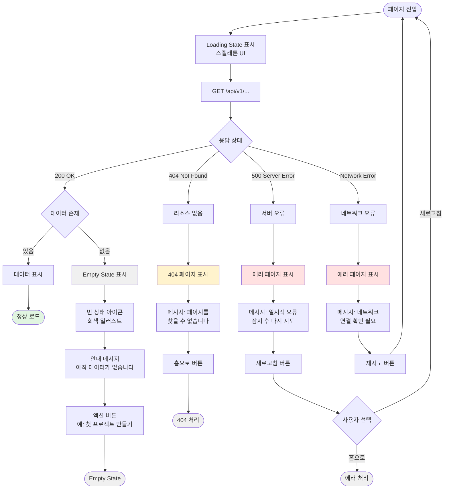
```mermaid
flowchart TD
    Start([페이지 진입]) --> Loading[Loading State 표시<br/>스켈레톤 UI]
    Loading --> FetchData[GET /api/v1/...]
    FetchData --> Check{응답 상태}
    
    Check -->|200 OK| DataCheck{데이터 존재}
    DataCheck -->|있음| ShowData[데이터 표시]
    ShowData --> End1([정상 로드])
    
    DataCheck -->|없음| EmptyState[Empty State 표시]
    EmptyState --> EmptyIcon[빈 상태 아이콘<br/>회색 일러스트]
    EmptyIcon --> EmptyMessage[안내 메시지<br/>아직 데이터가 없습니다]
    EmptyMessage --> EmptyAction[액션 버튼<br/>예: 첫 프로젝트 만들기]
    EmptyAction --> End2([Empty State])
    
    Check -->|404 Not Found| NotFound[리소스 없음]
    NotFound --> NotFoundPage[404 페이지 표시]
    NotFoundPage --> NotFoundMessage[메시지: 페이지를<br/>찾을 수 없습니다]
    NotFoundMessage --> HomeBtn[홈으로 버튼]
    HomeBtn --> End3([404 처리])
    
    Check -->|500 Server Error| ServerError[서버 오류]
    ServerError --> ErrorPage[에러 페이지 표시]
    ErrorPage --> ErrorMessage[메시지: 일시적 오류<br/>잠시 후 다시 시도]
    ErrorMessage --> RefreshBtn[새로고침 버튼]
    RefreshBtn --> UserChoice{사용자 선택}
    UserChoice -->|새로고침| Start
    UserChoice -->|홈으로| End4([에러 처리])
    
    Check -->|Network Error| NetworkError[네트워크 오류]
    NetworkError --> NetworkPage[에러 페이지 표시]
    NetworkPage --> NetworkMessage[메시지: 네트워크<br/>연결 확인 필요]
    NetworkMessage --> RetryBtn[재시도 버튼]
    RetryBtn --> Start
    
    style EmptyState fill:#f0f0f0
    style NotFoundPage fill:#fff3cd
    style ErrorPage fill:#ffe1e1
    style NetworkPage fill:#ffe1e1
    style End1 fill:#e1f5e1
    style End2 fill:#f0f0f0
    style End3 fill:#f0f0f0
    style End4 fill:#f0f0f0
```

**복구 경로**:
1. **Empty State**: 안내 메시지 + 액션 버튼 (데이터 생성)
2. **404**: 404 페이지 + 홈으로 버튼
3. **500**: 에러 페이지 + 새로고침 버튼
4. **Network Error**: 에러 페이지 + 재시도 버튼

**사용자 피드백**:
- **Empty State**: 회색 일러스트, 안내 텍스트, 파란 액션 버튼
- **404 페이지**: 노란 배경, 404 일러스트, 홈 버튼
- **에러 페이지**: 빨간 배경, 에러 일러스트, 새로고침 버튼

### 8.6. 사용자 피드백 컴포넌트 명세

#### Toast 컴포넌트
```typescript
interface ToastProps {
  type: 'success' | 'error' | 'warning' | 'info';
  message: string;
  duration: number; // ms, 0 = 무제한
  position: 'top-center' | 'top-right' | 'bottom-center';
  action?: {
    label: string;
    onClick: () => void;
  };
}

// 스타일 정의
const toastStyles = {
  success: { bg: '#D4EDDA', icon: 'CheckCircle', color: '#155724' },
  error: { bg: '#FEE2E2', icon: 'XCircle', color: '#991B1B' },
  warning: { bg: '#FEF3C7', icon: 'AlertTriangle', color: '#92400E' },
  info: { bg: '#DBEAFE', icon: 'Info', color: '#1E40AF' }
};
```

#### Modal 컴포넌트
```typescript
interface ModalProps {
  type: 'confirm' | 'alert' | 'error';
  title: string;
  message: string;
  primaryAction: {
    label: string;
    onClick: () => void;
  };
  secondaryAction?: {
    label: string;
    onClick: () => void;
  };
}
```

#### Inline Error 컴포넌트
```typescript
interface InlineErrorProps {
  fieldId: string;
  message: string;
  icon?: boolean;
}

// 스타일
const inlineErrorStyle = {
  color: '#EF4444',
  fontSize: '14px',
  marginTop: '4px',
  display: 'flex',
  alignItems: 'center',
  gap: '4px'
};
```

---

## 8. 모바일 플로우 차이점

### 8.1. 네비게이션

- **Desktop:** 상단 GNB (항상 표시)
- **Mobile:** 햄버거 메뉴 (사이드 드로어)

### 8.2. 커리큘럼 플래너

- **Desktop:** 드래그 앤 드롭
- **Mobile:** 과목 탭 → 학기 선택 → 추가 버튼

### 8.3. 프로젝트 갤러리

- **Desktop:** 3열 그리드
- **Mobile:** 1열 리스트 (무한 스크롤)

---

## 부록: 플로우 다이어그램 도구

본 문서의 플로우를 시각화하려면 다음 도구를 사용하세요:

- **Figma:** 와이어프레임 및 프로토타입
- **Miro:** 사용자 여정 맵
- **Lucidchart:** 플로우차트


## 9. 마이크로 인터랙션 정의

### 9.1. 버튼 인터랙션

#### 기본 버튼
- **Hover**: 배경색 10% 어두워짐, 0.2초 transition
- **Active**: 배경색 20% 어두워짐, scale(0.98)
- **Disabled**: 불투명도 50%, cursor: not-allowed
- **Loading**: 스피너 아이콘 회전, 텍스트 "처리 중..."

#### 아이콘 버튼
- **Hover**: 배경 원형 표시 (rgba(0,0,0,0.05)), scale(1.1)
- **Active**: 배경 원형 진하게 (rgba(0,0,0,0.1)), scale(0.95)
- **Ripple Effect**: 클릭 시 물결 효과 (Material Design)

### 9.2. 입력 필드 인터랙션

#### Text Input
- **Focus**: 테두리 색상 파란색 (#3B82F6), 2px, 0.2초 transition
- **Blur**: 테두리 회색 (#D1D5DB), 1px
- **Error**: 테두리 빨간색 (#EF4444), 흔들림 애니메이션 (shake)
- **Success**: 테두리 초록색 (#10B981), 체크 아이콘 표시

#### Dropdown
- **Open**: 드롭다운 메뉴 fade-in (0.2초), 위에서 아래로 slide
- **Close**: fade-out (0.15초)
- **Hover Item**: 배경색 회색 (#F3F4F6)
- **Selected Item**: 배경색 파란색 (#DBEAFE), 체크 아이콘

### 9.3. 드래그 앤 드롭 인터랙션

#### 드래그 시작
- **Grab**: cursor: grab → grabbing
- **Lift**: 카드 shadow 증가 (0 4px 12px rgba(0,0,0,0.15))
- **Opacity**: 원본 위치 불투명도 50%

#### 드래그 중
- **Ghost**: 드래그 중인 카드 따라다님, 약간 회전 (rotate(2deg))
- **Drop Zone Highlight**: 유효한 드롭 영역 파란 테두리 점선
- **Invalid Zone**: 빨간 테두리, cursor: not-allowed

#### 드롭
- **Success**: 카드 부드럽게 배치 (0.3초 ease-out), 초록 플래시
- **Fail**: 카드 원위치 복귀 (0.3초 ease-in-out), 흔들림

### 9.4. 로딩 상태 인터랙션

#### 스켈레톤 UI
- **애니메이션**: 좌→우 shimmer 효과 (1.5초 반복)
- **색상**: 배경 #F3F4F6, shimmer #E5E7EB
- **형태**: 실제 콘텐츠 레이아웃과 동일

#### Progress Bar
- **진행**: 0-100% 부드러운 증가 (0.3초 transition)
- **색상**: 파란색 (#3B82F6)
- **완료**: 초록색 (#10B981), 체크 아이콘

#### Spinner
- **회전**: 360도 무한 회전 (1초)
- **색상**: 파란색 (#3B82F6)
- **크기**: 작음 16px, 중간 24px, 큰 32px

### 9.5. 피드백 인터랙션

#### Toast 등장/퇴장
- **등장**: 위에서 slide-down (0.3초 ease-out)
- **퇴장**: fade-out + slide-up (0.2초 ease-in)
- **자동 닫기**: duration 후 자동 퇴장

#### Modal 등장/퇴장
- **등장**: 배경 fade-in (0.2초), 모달 scale(0.95 → 1) + fade-in (0.3초)
- **퇴장**: 역순 애니메이션 (0.2초)
- **배경 클릭**: 모달 흔들림 (shake) + 닫기

#### Tooltip
- **등장**: fade-in (0.15초), 약간 위로 이동 (translateY(-4px))
- **퇴장**: fade-out (0.1초)
- **위치**: 요소 상단 중앙, 화면 밖이면 하단으로

### 9.6. 리스트 인터랙션

#### 카드 Hover
- **효과**: shadow 증가 (0 4px 12px rgba(0,0,0,0.1)), 약간 위로 (translateY(-4px))
- **Transition**: 0.2초 ease-out

#### 무한 스크롤
- **트리거**: 하단 200px 도달 시 다음 페이지 로드
- **로딩**: 하단에 스피너 표시
- **완료**: 새 항목 fade-in (0.3초)

#### 필터 적용
- **애니메이션**: 기존 항목 fade-out (0.2초) → 새 항목 fade-in (0.3초)
- **Empty State**: 필터 결과 없을 시 fade-in (0.3초)

### 9.7. 네비게이션 인터랙션

#### 페이지 전환
- **효과**: fade-out (0.15초) → fade-in (0.2초)
- **스크롤**: 새 페이지 최상단으로 부드럽게 이동

#### 탭 전환
- **효과**: 콘텐츠 fade-out (0.1초) → fade-in (0.2초)
- **인디케이터**: 선택된 탭 하단 바 slide (0.3초 ease-out)

#### 아코디언
- **열기**: height 0 → auto, 0.3초 ease-out
- **닫기**: height auto → 0, 0.2초 ease-in
- **아이콘**: 화살표 rotate(0deg → 180deg)

## 10. 이탈 지점 분석 및 개선 방안

### 10.1. 회원가입 플로우 이탈 지점

#### 이탈 지점 1: 회원가입 폼 (예상 이탈률 30%)
**원인**:
- 입력 항목 과다 (8개 필드)
- 학번, 전공 등 민감 정보 요구
- 비밀번호 복잡도 요구사항 불명확

**개선 방안**:
1. **단계별 입력**: 3단계로 분할 (기본 정보 → 학적 정보 → 관심 트랙)
2. **진행 표시**: Progress Bar 표시 (1/3, 2/3, 3/3)
3. **실시간 검증**: 입력 즉시 유효성 피드백
4. **비밀번호 강도 표시**: 시각적 강도 미터 (약함/보통/강함)
5. **소셜 로그인**: Google, Kakao 간편 가입 옵션

**측정 지표**:
- 폼 시작 → 완료 전환율
- 각 필드별 이탈률
- 평균 작성 시간

#### 이탈 지점 2: 이메일 중복 에러 (예상 이탈률 15%)
**원인**:
- 이미 가입한 사실 인지 못함
- 에러 후 재입력 번거로움

**개선 방안**:
1. **실시간 중복 체크**: 이메일 입력 후 blur 시 즉시 확인
2. **로그인 유도**: "이미 가입하셨나요? 로그인하기" 링크
3. **비밀번호 찾기**: 중복 에러 시 비밀번호 재설정 옵션

**측정 지표**:
- 중복 에러 발생 후 로그인 전환율
- 중복 에러 후 재가입 시도율

### 10.2. 커리큘럼 플래너 이탈 지점

#### 이탈 지점 3: 빈 플래너 화면 (예상 이탈률 40%)
**원인**:
- 8학기 빈 그리드가 압도적
- 어디서부터 시작해야 할지 모름
- 과목 검색 방법 불명확

**개선 방안**:
1. **온보딩 투어**: 첫 방문 시 인터랙티브 가이드 (3단계)
2. **추천 과목**: 트랙별 필수 과목 자동 제안
3. **템플릿 제공**: "선배 플랜 가져오기" 버튼 강조
4. **비디오 튜토리얼**: 우측 상단에 "사용법 보기" 링크
5. **Quick Start**: "AI 추천 플랜 생성" 버튼 (베타)

**측정 지표**:
- 빈 플래너 → 첫 과목 배치 전환율
- 온보딩 투어 완료율
- 템플릿 사용률

#### 이탈 지점 4: 유효성 검사 에러 (예상 이탈률 25%)
**원인**:
- 선수과목 미이수 에러 반복
- 학점 초과 에러 이해 어려움
- 에러 해결 방법 불명확

**개선 방안**:
1. **스마트 제안**: 선수과목 미이수 시 "먼저 이수해야 할 과목" 표시
2. **자동 조정**: 학점 초과 시 "다른 학기로 이동" 버튼
3. **시각적 피드백**: 에러 과목 빨간 테두리 + Tooltip 상세 설명
4. **도움말 링크**: 에러 메시지에 "자세히 보기" 링크

**측정 지표**:
- 에러 발생 후 해결 성공률
- 에러 발생 후 이탈률
- 평균 에러 해결 시간

### 10.3. 프로젝트 업로드 플로우 이탈 지점

#### 이탈 지점 5: Step 2 미디어 업로드 (예상 이탈률 35%)
**원인**:
- 파일 업로드 시간 오래 걸림
- 업로드 실패 시 재시도 번거로움
- 썸네일 필수 요구사항 부담

**개선 방안**:
1. **임시 저장**: 각 Step 완료 시 자동 임시 저장
2. **백그라운드 업로드**: 다음 Step 진행 중 백그라운드 업로드
3. **Progress 표시**: 각 파일별 업로드 진행률 표시
4. **썸네일 생성**: 동영상 업로드 시 자동 썸네일 추출
5. **나중에 추가**: "미디어 나중에 추가" 옵션

**측정 지표**:
- Step 2 완료율
- 평균 업로드 시간
- 업로드 실패율

#### 이탈 지점 6: Step 5 본문 작성 (예상 이탈률 20%)
**원인**:
- Markdown 문법 생소함
- 긴 본문 작성 부담
- 작성 중 데이터 손실 우려

**개선 방안**:
1. **WYSIWYG 에디터**: Markdown + 비주얼 에디터 토글
2. **템플릿 제공**: "프로젝트 소개 템플릿" 버튼
3. **자동 저장**: 30초마다 LocalStorage 자동 저장
4. **AI 요약**: "AI로 요약 생성" 버튼 (베타)
5. **최소 길이 제거**: 본문 최소 길이 요구사항 제거

**측정 지표**:
- Step 5 완료율
- 평균 작성 시간
- 자동 저장 복구 사용률

### 10.4. 로그인 플로우 이탈 지점

#### 이탈 지점 7: 로그인 실패 (예상 이탈률 20%)
**원인**:
- 비밀번호 기억 못함
- 이메일 오타
- 계정 잠금

**개선 방안**:
1. **비밀번호 표시**: "비밀번호 보기" 아이콘
2. **자동 완성**: 브라우저 자동 완성 지원
3. **비밀번호 찾기**: 로그인 폼 하단에 명확히 표시
4. **소셜 로그인**: Google, Kakao 간편 로그인
5. **이메일 제안**: 오타 감지 시 "혹시 @ajou.ac.kr?" 제안

**측정 지표**:
- 로그인 실패 후 재시도율
- 비밀번호 찾기 사용률
- 소셜 로그인 사용률

### 10.5. 전체 플로우 개선 전략

#### 공통 개선 방안
1. **진행 상태 저장**: 모든 플로우에서 중간 저장 지원
2. **명확한 CTA**: 다음 액션 버튼 명확히 표시
3. **에러 복구**: 모든 에러에 명확한 복구 경로 제공
4. **도움말**: 각 화면에 컨텍스트 도움말 제공
5. **피드백 수집**: 이탈 시점에 "어려운 점이 있나요?" 설문

#### 측정 및 모니터링
```typescript
// 이탈 지점 추적 이벤트
interface DropOffEvent {
  flowName: string;        // 'signup', 'curriculum', 'project_upload'
  stepName: string;        // 'step_1', 'step_2', etc.
  action: 'enter' | 'exit' | 'error';
  timestamp: Date;
  userId?: string;
  sessionId: string;
  errorType?: string;
}

// 개선 효과 측정 지표
interface FlowMetrics {
  flowName: string;
  totalStarts: number;
  totalCompletions: number;
  conversionRate: number;  // completions / starts
  avgDuration: number;     // 평균 소요 시간 (초)
  dropOffPoints: {
    stepName: string;
    dropOffRate: number;   // 해당 단계 이탈률
  }[];
}
```

---

## 부록: 플로우 개선 체크리스트

### 명사형 종결 적용 확인
- [x] 모든 섹션 제목 명사형 전환
- [x] 설명 문장 명사형 종결
- [x] 기술 명세 명사형 표현

### Mermaid 다이어그램 완성도
- [x] 주요 사용자 여정 5개 다이어그램 작성
- [x] 의사결정 분기 명확히 표현
- [x] 예외 처리 경로 포함
- [x] 색상 코딩 (성공/에러/경고)

### 의사결정 분기 명확성
- [x] 각 분기점 조건 명시
- [x] 각 경로 결과 정의
- [x] 조건 검증 로직 포함

### 예외 처리 완전성
- [x] 네트워크 에러 처리
- [x] 인증 에러 처리
- [x] 입력 검증 에러 처리
- [x] 파일 업로드 에러 처리
- [x] 데이터 로드 에러 처리
- [x] 사용자 피드백 컴포넌트 명세

### 마이크로 인터랙션 정의
- [x] 버튼 인터랙션
- [x] 입력 필드 인터랙션
- [x] 드래그 앤 드롭 인터랙션
- [x] 로딩 상태 인터랙션
- [x] 피드백 인터랙션
- [x] 리스트 인터랙션
- [x] 네비게이션 인터랙션

### 이탈 지점 분석
- [x] 회원가입 플로우 이탈 지점 2개
- [x] 커리큘럼 플래너 이탈 지점 2개
- [x] 프로젝트 업로드 이탈 지점 2개
- [x] 로그인 플로우 이탈 지점 1개
- [x] 각 이탈 지점별 개선 방안 제시
- [x] 측정 지표 정의
